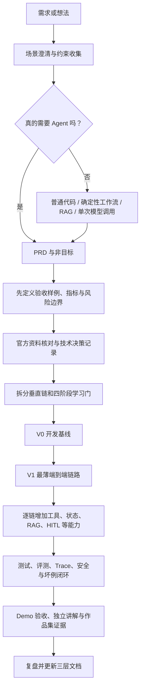
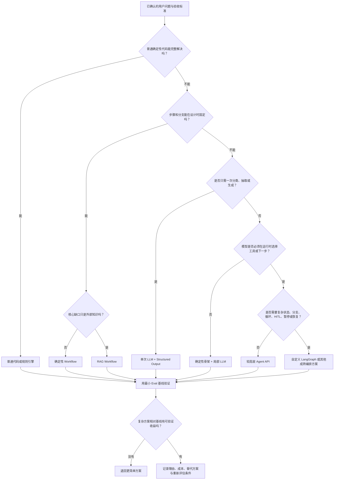
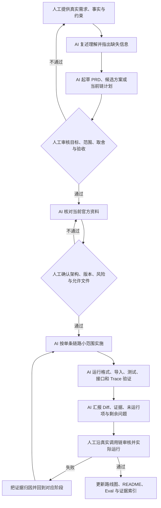

# Agent 求职作品开发流程

> 版本：v0.1 初稿  
> 状态：可使用的初稿，待至少三个不同类型 Demo 验证  
> 更新日期：2026-07-17  
> 适用范围：面向求职、作品集、学习验证和技术方案验证的 Agent / LLM 应用项目  
> 维护方式：每完成一个真实 Demo、重大 Badcase 复盘、关键框架升级、市场校准或真实面试反馈后复盘更新；保留历史版本记录，不覆盖旧结论  
> 当前限制：本文是一份基于现有项目经验和当前官方资料形成的初稿，尚未在多个完整新项目中反复验证

> 2026-07-21 纠偏：本文中的 "Demo" 只表示可展示的求职作品形态，不表示玩具实现、比赛受限实现或低标准样例。凡涉及 RAG、MCP、Agent 编排、评测、观测、安全、性能、记忆等能力，默认优先采用业界主流框架、服务或库。手写实现只能作为 fallback、教学 baseline 或明确的对照实验，不能作为工业级完成证据。

## 1. 这份手册解决什么问题

这份手册不是“怎样快速堆出一个看起来像 Agent 的目录”，而是回答以下问题：

1. 一个需求是否真的需要 Agent，还是普通代码、确定性工作流、RAG 或单次模型调用已经足够？
2. 如何把一个模糊想法变成可验收的 PRD、评测集和开发路线？
3. 如何先做出一条可运行、可测试、可观察、可讲清楚的端到端链路，再逐步增加能力？
4. 如何让 Codex、Claude Code 等 AI 编码 Agent 承担大量实现工作，同时由人保留产品判断、架构判断、风险判断和最终验收权？
5. 如何避免“文档很完整、目录很多、代码能导入，但真实业务链路并没有跑通”的假完成？
6. 如何把开发过程沉淀成面试证据、学习证据和下一次可复用的方法资产？

本文优先服务于 Demo 和就业准备。它会覆盖生产思维，但不会要求一个早期 Demo 一开始就承担完整生产系统的所有复杂度。

## 2. 先记住这一句话

**先定义真实场景和通过证据，再选择最简单的可行技术；先跑通一条薄的垂直链路，再按高价值问题逐链扩展；AI 可以大量写代码，但不能替人决定需求是否正确、风险是否可接受、结果是否真的通过。**

## 3. 五份重要产物，归入三个层级

为了避免以后再次忘记每个文件的作用，可以把当前和计划中的五份重要产物固定分成下面三类。

| 层级 | 文件 | 作用 | 什么时候读 | 什么时候更新 |
| --- | --- | --- | --- | --- |
| 长期治理与方法资产层 | `AGENTS.md` | 所有项目共同遵守的稳定原则、协作规则、学习标准和质量底线 | 每个新任务开始前 | 只有跨项目长期有效的规则发生变化时 |
| 长期治理与方法资产层 | `agent demo开发流程.md` | 从需求到验收的可复用作业手册，包含流程、角色、模板和检查表 | 启动新 Demo、设计新迭代或复盘时 | 新项目验证出更好的流程，或发现流程缺口时 |
| 长期治理与方法资产层 | `LEARNING-METHOD-FORMATION.md`（计划产物） | 记录这套学习方法如何形成，保留可复现的思考过程，也可改写为对外分享内容 | 回顾方法来源、分享经验或校正学习方式时 | 发生关键认知转折或形成新方法论时 |
| 外部证据与方向校准层 | `INTERVIEW-MARKET.md` | 保存有日期、有来源的面经、岗位要求和高频问题，防止只凭个人感觉规划学习 | 里程碑规划、求职方向变化、面试前 | 新面经、新 JD、真实面试反馈或市场明显变化时 |
| 当前项目执行与验收层 | `AGENT-CHAIN.md` | 当前项目学到哪里、下一步做什么、每条链如何验收、证据在哪里 | 每次进入当前项目和每个阶段边界 | 每个阶段开始、通过、阻塞或路线调整时 |

三个分类名可以简记为：

1. **长期治理与方法资产**
2. **外部证据与方向校准**
3. **当前项目执行与验收**

文件职责必须保持分离：

- 不要把短期框架版本和一次面经写成永久的 `AGENTS.md` 规则。
- 不要把某个项目的当前进度写进跨项目开发手册。
- 不要让市场报告直接替代工程判断；它负责校准优先级，不负责证明代码正确。
- 不要让路线图只记录“已讲解”或“已创建文件”；它应记录运行、测试、Trace、评测和用户独立解释等证据。

## 如何使用这份手册

不需要每次从头读完 2000 多行。按场景使用：

- **第一次形成新想法**：读第 1 至 9 节，再使用模板 A、B、C 和“新 Demo 启动检查表”。
- **从 PRD 进入开发**：读第 10 至 22 节，重点执行评测先行、框架决策和薄垂直链。
- **让 AI 编码 Agent 实现**：读第 23 至 28 节，按模板 F、G、H 形成“预检、实现、运行、人工审核”闭环。
- **实现具体 Agent 能力**：按需查第 29 至 37 节，不要把所有能力一次加入。
- **补质量证据**：查第 38 至 44 节，并使用模板 I、J、K。
- **最终验收或复盘**：使用模板 L、M、N 和第 60 至 65 节检查表。
- **核对依据与过期风险**：查第 66 至 71 节，并在使用前重新打开版本敏感的官方链接。

本文严格按三层使用：

1. **快速入口**：第 1 至 9 节，帮助快速判断方向。
2. **完整流程**：第 10 至 44 节，解释从需求到工程证据的完整做法。
3. **附录工具箱**：第 45 至 71 节，提供 Prompt、检查表、资料依据和维护记录。

## 第一层：快速入口

## 4. 宏观流程



流程不是瀑布式的一次性文档生产。PRD、评测集、路线图和代码会迭代，但每次变化都要有原因、有版本、有受影响的验收项，不能让实现悄悄改写需求。

### 一页启动卡

| 顺序 | 现在只做什么 | 通过证据 |
| --- | --- | --- |
| 1. 问题 | 写清用户、场景、结果、约束、非目标和最坏失败 | 一页需求卡经人工确认 |
| 2. 形态 | 比较普通代码、Workflow、RAG、单次 LLM、高层 Agent 和 LangGraph | 选择、成本、替代方案和退回条件 |
| 3. 契约 | 起草 PRD，并在架构前定义最小 Eval 集和最简单基线 | P0 场景逐项映射验收样例 |
| 4. 方案 | 查当前官方资料，只为已确认需求选择组件 | 架构图、版本快照和必要 ADR |
| 5. 切链 | 先切一条从真实入口到用户结果和 Trace 的薄纵切 | 当前唯一 Chain、范围和四阶段门 |
| 6. 实现 | V0 只建启动基线；V1 接真实模型、必要真实工具、最小状态、入口、Trace 和测试 | Fake E2E 与受控真实 Smoke 均有证据 |
| 7. 深化 | 只根据需求、坏例和评测逐链增加 RAG、Memory、MCP、HITL 等 | 目标分组改善且关键回归可解释 |
| 8. 交付 | 跑测试、Eval、安全与人工验收，完成 README、演示、讲解和迁移题 | 第三方可复现，用户可独立解释和修改 |
| 9. 回写 | 按归属更新长期规则、流程、市场证据和当前路线图 | 复盘记录含证据等级和适用边界 |

## 5. 十二条不可妥协的规则

1. **先做 Agent 必要性判断。** “想学 LangGraph”不是业务必须使用 Agent 的证据。
2. **先写可观察的成功条件。** “效果不错”“更智能”不能作为验收标准。
3. **先做薄垂直链。** 第一条链应穿过入口、编排、模型或替身、工具、状态、输出和 Trace，而不是先横向造完所有基础设施。
4. **优先高层成熟能力。** 标准模型工具循环优先使用成熟 Agent API；只有明确需要复杂拓扑时才下沉到低层图编排。
5. **模型不拥有最终权限。** 权限、参数校验、策略检查、审批和副作用执行必须由确定性代码控制。
6. **结构化数据使用结构化接口。** 能用类型模型、工具 Schema 或 Structured Output 时，不用正则从自然语言里猜 JSON。
7. **状态必须有明确所有者和语义。** 每个字段都要说明谁写、谁读、如何合并、何时持久化和何时清除。
8. **测试和评测分开。** 确定性代码用测试验证；概率性质量用有版本的数据集和评测验证。
9. **“能导入”不等于“能工作”。** 至少要有真实入口调用、关键分支、错误路径和一次可复现运行。
10. **Trace 是工程证据，不是装饰。** 关键运行应能回答模型做了什么、工具做了什么、哪里慢、哪里错、花费多少。
11. **AI 自审不是独立验收。** 生成代码的 Agent 可以先自查，但人必须检查关键调用链、风险边界和运行证据。
12. **完成代码不等于学会。** 用户应能独立解释、诊断一个新坏例，并完成一个未照抄过的小修改。

## 6. 先判断需要哪种系统

### 6.1 技术形态决策树



这棵树选择的是**起始形态**，不是永久架构。RAG 可以后来成为 Agent 的一个工具，高层 Agent 也可以在出现真实复杂拓扑后迁移到 LangGraph；反过来，如果评测证明动态决策没有收益，也应退回确定性 Workflow。

### 6.2 系统形态决策表

| 需求特征 | 优先选择 | 不应急着使用 Agent 的原因 |
| --- | --- | --- |
| 输入、规则、步骤和输出都明确 | 普通代码或规则引擎 | 确定性实现更便宜、更稳定、更容易测试 |
| 步骤固定，但包含多个服务调用和重试 | 确定性工作流 / 任务编排 | 编排复杂不等于需要模型自主决策 |
| 核心问题是根据私有知识回答并给出处 | RAG 管线 | 检索增强不自动等于 Agent |
| 只需一次分类、抽取、改写或生成 | 单次模型调用 + Structured Output | 没有循环规划和工具选择需求 |
| 需要模型在运行时根据不完整信息选择工具、观察结果并调整下一步 | Agent | 这里才出现有价值的动态决策 |
| 固定流程中只有一两个不确定步骤 | 混合工作流 | 确定性骨架中局部使用模型通常更可控 |

### 6.3 Agent 必要性五问

在 PRD 前先回答：

1. 如果去掉模型自主选择，能否用固定步骤完成 80% 以上的核心价值？
2. 运行中是否存在事先无法枚举、但模型可根据上下文选择的下一步？
3. 是否必须调用多个工具，并根据工具结果循环调整？
4. 是否需要跨轮状态、恢复、中断或人工审批？
5. 使用 Agent 带来的收益，是否足以覆盖错误率、延迟、成本和安全复杂度？

若前四问大多为“否”，优先实现更简单的形态。即使最终为了学习 Agent 而刻意加入 Agent，也要在文档中诚实标注：这是**学习目标驱动的技术实验**，不是业务上唯一合理的方案。

## 7. 再判断使用哪一层框架

| 场景 | 推荐起点 | 进入下一层的触发条件 |
| --- | --- | --- |
| 普通 API、规则、数据处理 | Python / FastAPI 等常规技术栈 | 出现真实模型能力需求 |
| 单次 LLM 调用、抽取、分类 | 模型 SDK + Pydantic / Structured Output | 需要工具循环或多步状态 |
| 标准的“模型选择工具并循环” | LangChain `create_agent` 或同类高层 Agent API | 需要显式图拓扑、定制状态或复杂恢复 |
| 分支、并行、循环、持久化、HITL、长任务恢复 | 自定义 LangGraph `StateGraph` | 不再继续下沉，除非有被证明的框架缺口 |
| 多个客户端需要标准化访问外部工具、资源或提示模板 | MCP 客户端 / 服务端 | 只有存在跨宿主复用和协议价值时才引入 |

当前 LangGraph 官方文档将它定位为低层编排运行时，并建议新手或简单场景考虑 LangChain 的高层 Agent。选择 LangGraph 应来自以下至少一个明确需求：

- 需要可视化和控制固定拓扑，而不是自由工具循环。
- 需要自定义状态字段与 Reducer。
- 需要持久化检查点、线程恢复或 time travel。
- 需要在图内可靠地暂停并通过 `interrupt()` / `Command(resume=...)` 恢复。
- 需要明确的并行、子图、循环上限或节点级重试。

“主流”不代表“所有 Demo 默认都使用”。框架选择必须写成决策，而不是习惯。

## 8. 最小产物集

一个求职型 Agent Demo 至少维护：

| 产物 | 最小内容 | 为什么需要 |
| --- | --- | --- |
| `AGENTS.md` | 稳定协作规则、质量标准、允许和禁止事项 | 让新的 AI 任务继承一致约束 |
| `PRD.md` | 用户、问题、范围、非目标、场景、验收、指标、风险 | 防止代码反向定义需求 |
| 项目路线图，如 `AGENT-CHAIN.md` | 当前链、四阶段门、证据、问题、下一步 | 保持学习和交付状态可见 |
| `README.md` | 环境、配置、启动、测试、演示和已知限制 | 让第三方可复现 |
| `tests/` | 关键确定性行为和回归测试 | 证明代码行为 |
| `evals/` 或评测记录 | 有版本的样例集、指标和基线 | 证明 LLM / Agent 质量 |
| Trace 或结构化运行记录 | 一次成功、一次失败、关键耗时和调用 | 证明链路真实运行且可诊断 |

以下文件按复杂度增加，不要为了“显得专业”预先制造：

- `ADR/`：存在重要且可争议的架构选择时增加。
- `ARCHITECTURE.md`：系统边界已经复杂到 README 无法清楚表达时增加。
- `THREAT-MODEL.md`：工具有敏感数据、高权限或外部副作用时增加。
- `RUNBOOK.md`：演示、部署或恢复步骤超过 README 可承载范围时增加。

## 9. Demo 的完成证据

“完成”至少同时满足五类证据：

| 证据 | 最低要求 |
| --- | --- |
| 行为证据 | 核心用户场景从真实入口端到端成功 |
| 自动化证据 | 最小相关测试通过，关键回归有测试 |
| 质量证据 | 固定评测集有基线和结果，不只展示一个精选样例 |
| 运维证据 | 能通过 Trace / 日志定位调用、耗时和失败点 |
| 掌握证据 | 用户能脱离逐步提示讲解架构、权衡、坏例和个人贡献，并完成迁移题或小修改 |

目录、类名、接口声明、健康检查返回 `ok`、一张静态架构图，都不能单独证明能力完成。

## 第二层：完整流程

## 10. 两个循环同时运转

Agent Demo 开发同时包含两个循环。

### 10.1 统一术语

| 术语 | 精确定义 | 容易混淆之处 |
| --- | --- | --- |
| Scenario | 某类用户在给定前置条件和约束下，以一个输入或事件触发系统，并期待可观察结果的需求场景 | Scenario 是需求与验收单位，不是代码函数 |
| Workflow | 由开发者预先规定主要步骤、分支和顺序的控制流，其中可以包含 LLM 节点 | 使用了 LLM 不代表就是 Agent |
| Turn | 一次用户输入及其对应系统响应的交互轮次 | 一个 Turn 内可以触发多个模型或工具调用 |
| Run | Workflow 或 Agent 从一次输入开始，到完成、失败、暂停或取消为止的一次执行 | 一个 Turn 通常触发一个 Run，但事件型系统可以没有对话 Turn |
| Thread | 将多个相关 Run 关联起来并共享检查点或会话状态的逻辑容器 | Thread 不等于跨会话长期记忆，也不应默认跨用户共享 |
| Trace | 对一次任务或 Run 的完整可观测记录，由模型、节点、检索、工具和存储等多个 Span / Run 组成 | Trace 是运行证据；普通最终日志不能替代完整调用轨迹 |
| 端到端链路 | 从真实入口经过必要边界，到达用户可见结果和运行证据的完整纵向路径 | 它跨越模块，不能由一个孤立节点或目录证明 |
| 能力链路 | 为增加一个主要能力或解决一个主要风险而划定的可审查开发范围 | 一条能力链路可以扩展已有端到端链路，不应横向包揽所有基础设施 |
| 学习阶段 | 每条能力链依次经历的理解、实现读码、运行测试、复盘迁移四个验收阶段 | 学习阶段描述人的掌握证据，不是图中的 Node / Stage |

关系可以简记为：**Scenario 定义要解决什么；Workflow 或 Agent 定义怎样控制；Run 是一次实际执行；Thread 关联多次执行；Trace 保存执行证据；端到端链路证明用户结果；能力链路控制迭代范围；学习阶段证明人真正掌握。**

### 10.2 交付循环

需求澄清 → 评测契约 → 技术决策 → 薄垂直链 → 逐链扩展 → Demo 验收。

### 10.3 学习循环

每一条能力链都按四阶段通过：

1. **链路理解**：边界、输入、输出、文件、调用顺序、依赖和缺陷。
2. **实现与读码**：只实现当前链，理解重要设计选择和关键分支。
3. **真实运行与测试**：运行命令、自动化测试、API 调用、Trace 和错误诊断。
4. **复盘与迁移**：独立讲解，加一个没照抄过的诊断、修改或迁移任务。

交付循环保证“产品真的向前走”，学习循环保证“人真的会了”。两者不能互相替代。

### 10.4 十二阶段统一控制表

后文逐阶段解释“为什么”和“怎样做”；下面两张表是统一阶段契约，补齐每个阶段的输入、关键问题、非目标、分工、产出、人工审批、退出标准、常见错误和失败回退。任何项目裁剪步骤时，也必须保留对应决策和证据，不能直接略过。

| 阶段 | 目的、输入与关键问题 | 本阶段非目标 | 人工负责 | AI Agent 可负责 | 产出、证据与人工批准点 |
| --- | --- | --- | --- | --- | --- |
| 0 需求输入 | 输入为想法、材料和约束；确认谁在什么情境解决什么问题 | 不选框架，不写业务代码 | 提供事实、价值、风险和限制 | 整理事实、假设、冲突并提出问题 | 需求卡；人工批准问题定义、非目标和最坏失败 |
| 1 Agent 审查 | 输入为需求卡；判断动态决策是否真实存在 | 不为学习框架强造需求 | 选择可接受的系统形态和复杂度 | 比较普通代码、Workflow、RAG、单次 LLM、Agent | 决策记录与反事实；人工批准是否使用 Agent |
| 2 PRD | 输入为已确认需求；把场景转为可验收契约 | 不把具体框架写成产品目标 | 决定范围、优先级、阈值和风险容忍度 | 起草 PRD、补失败路径和映射 | `PRD.md` v0.1；人工批准 P0 场景、非目标和验收 |
| 3 评测契约 | 输入为 PRD；先定义何为正确、失败和禁止 | 不先调 Prompt，不用精选 Demo 代替数据集 | 确认样例代表性、标签和一票否决项 | 起草样例、规则 Grader 和基线脚本 | 版本化 Eval 集、指标和最简单基线；人工批准标签与门槛 |
| 4 技术决策 | 输入为 PRD、Eval 和现有代码；选择最小可行架构 | 不设计没有验收需求的未来平台 | 选择架构、依赖、权限和剩余风险 | 查当前官方资料、比较方案、起草 ADR | 版本表、架构图、少量 ADR 和最小验证；新增依赖与高风险设计须批准 |
| 5 路线拆分 | 输入为架构与验收映射；切出薄的端到端链和能力链 | 不按技术目录横向造完整骨架 | 决定业务优先级和当前唯一链路 | 建议依赖顺序、范围和阶段门 | 项目路线图；人工批准当前 Chain、Stage 和延期项 |
| 6 V0 基线 | 输入为第一条链需要的最小环境；证明可启动和测试 | 不提前建设完整生产平台 | 管理密钥、安装决定和环境边界 | 建配置、入口、测试骨架和 README | 可复现启动、配置失败和最小测试证据；安装、秘密和危险命令须批准 |
| 7 V1 纵切 | 输入为 P0 场景；形成薄而真实的可演示 Run | 不同时增加多类高级能力或漂亮 UI | 确认真实模型费用、工具权限并亲自运行 | 小范围实现、测试、接口调用和 Trace 汇报 | 真实模型、必要真实工具、最小状态、真实入口、Trace 与测试；外部副作用须批准 |
| 8 能力迭代 | 输入为真实坏例或新增需求；一次增加一个能力 | 不按“可能有用”扩建 RAG、Memory、MCP 或多 Agent | 选择优先级、接受权衡和回归风险 | 先加失败样例，再做最小改动并比较结果 | 单链代码、测试、Eval、Trace 和路线图更新；新增权限与依赖须批准 |
| 9 质量收口 | 输入为各链证据；补跨链测试、安全和观测缺口 | 不用平均分掩盖关键失败，不临时包装生产级 | 决定残余风险、发布门和例外 | 跑回归、聚类 Badcase、检查脱敏和性能 | 覆盖矩阵、评测报告、威胁检查和已知风险；人工作 Go / No-Go 判断 |
| 10 Demo 验收 | 输入为可运行版本和证据；让第三方可复现、可追问 | 不隐藏失败，不把演示脚本当唯一测试 | 实际演示、独立讲解、合并或发布决定 | 整理 README、演示包、证据索引和模拟追问 | Demo、README、Trace、结果摘要和掌握证据；合并、Git 发布与对外发送须批准 |
| 11 复盘更新 | 输入为 Diff、测试、Eval、Trace、反馈和学习表现 | 不把一次个例立刻升级为永久规则 | 判断经验归属、适用边界和是否推广 | 分类成功、返工、假完成和候选改进 | 复盘与文档更新建议；长期规则变更须人工确认 |

### 10.5 退出、常见错误与失败回退表

| 阶段 | 验证与退出标准 | 常见错误 | 失败时回到哪里 |
| --- | --- | --- | --- |
| 0 | 用户、任务、结果、非目标和最坏失败都清楚 | 从框架名倒推需求 | 信息不足留在阶段 0；价值不成立则停止项目 |
| 1 | 有方案比较、选择理由、成本和退回条件 | “更智能”被当成理由 | 动态性不成立则选择简单形态并进入阶段 2；需求本身不清则回阶段 0 |
| 2 | 每个 P0 场景映射到验收和风险边界 | 模糊词、漏失败、实现反向改 PRD | 用户价值变化回阶段 0；范围和验收问题留在阶段 2 |
| 3 | 数据集有版本、覆盖关键分组并能区分基线 | 为当前实现改容易标签 | 标签不清回阶段 2；覆盖不足留在阶段 3 |
| 4 | 组件都映射需求，API 有当前一手依据，最小实验成立 | 先选 LangGraph、照搬旧教程、过度抽象 | 形态错误回阶段 1；需求映射缺失回阶段 2；兼容问题留在阶段 4 |
| 5 | 当前链可在合理时间完成四阶段并产生用户结果 | 横向基础设施链过大 | 重新缩小阶段 5；依赖决策错误回阶段 4 |
| 6 | 干净环境可启动，缺配置会明确失败，最小测试通过 | 模块堆叠、全局资源、虚假健康检查 | 依赖和架构错回阶段 4；实现问题留在阶段 6 |
| 7 | 真实入口跑通成功和真实失败路径，Trace 可定位 | 只跑 Fake、只导入、工具未接主链 | 契约错回阶段 2 或 3；架构错回阶段 4；环境错回阶段 6；局部缺陷留在阶段 7 |
| 8 | 新能力改善目标分组且无未解释关键回归 | 一次加多项能力、只调 Prompt | 评测不能定位回阶段 3；方案不成立回阶段 4；实现回退到该能力链 Stage 1 |
| 9 | P0 证据完整，关键安全门通过，残余风险有责任人 | 最后才补测试、日志泄密、平均分掩盖风险 | 回到缺口所有者：阶段 3、6、7 或 8，不在收口层打补丁掩盖根因 |
| 10 | 第三方可复现，用户能独立讲解和完成新任务 | 只演示精选成功路径、文档与行为不一致 | 行为失败回阶段 7/8；证据不足回阶段 9；掌握不足回当前 Chain 的学习阶段 |
| 11 | 每条经验有证据等级、适用边界和正确归属 | 个例写成永久规则、覆盖历史 | 证据不足保留为待验证假设；分类错误重新完成阶段 11 |

## 11. 阶段 0：需求输入与约束盘点

### 目标

把“我想做一个 Agent”改写成一个真实用户在特定情境下要完成的任务。

### 必须澄清的内容

- 谁使用：具体角色、技术水平、权限和使用环境。
- 在什么触发条件下使用：主动对话、定时任务、事件触发或嵌入业务流程。
- 当前怎样完成：人工步骤、已有系统和主要痛点。
- 什么结果有价值：节省时间、减少错误、提高覆盖、加快决策或改善体验。
- 可访问什么：数据源、工具、API、设备和模型。
- 不可访问什么：敏感数据、生产系统、外网、付费服务或高权限命令。
- 项目给谁看：自己学习、面试官、真实用户或团队决策者。
- 预算与时限：开发时间、单次调用成本、可接受延迟和设备限制。
- 最坏后果：答错、泄露、误操作、重复执行、状态串线或费用失控。

### 推荐输出

先写一页需求卡，不必立即创建很多文件：

```text
产品一句话：
目标用户：
核心任务：
当前做法及痛点：
预期结果：
必须使用的数据或工具：
主要约束：
不可接受的后果：
Demo 演示场景：
仍待确认的问题：
```

### AI 编码 Agent 的角色

- 读取现有材料，列出事实、假设和冲突。
- 以产品经理和工程师视角提出少量高信息量问题。
- 把用户口述整理成需求卡。
- 不得自行把未确认假设写成已确定需求。

### 人工关口

只有当以下问题能被一句或几句话回答时才进入下一阶段：

1. 谁在什么场景下解决什么问题？
2. 成功后用户能观察到什么变化？
3. 哪些事情明确不做？
4. 最严重的失败是什么？

## 12. 阶段 1：Agent 必要性审查

### 目标

证明 Agent 是合理形态，或明确选择更简单的方案。

### 审查步骤

1. 画出不使用 LLM 的最简单流程。
2. 标出其中真正需要语义理解、不确定判断或动态计划的位置。
3. 分别设计普通代码、固定工作流、RAG、单次 LLM 和 Agent 方案。
4. 比较正确性、可控性、成本、延迟、开发量、可解释性和学习价值。
5. 写出选择理由和反事实：什么条件变化时应退回更简单方案？

### 决策记录模板

```markdown
## 决策：是否使用 Agent

- 真实不确定性：
- 需要动态选择的工具或步骤：
- 最简单替代方案：
- Agent 带来的可验证收益：
- 新增风险与成本：
- 选择：
- 退回简单方案的触发条件：
```

### 人工关口

不能只回答“Agent 更智能”或“为了使用 LangGraph”。至少给出一个必须在运行时动态选择或恢复的场景，并说明为何固定流程不够。

若结论是不需要 Agent，应接受这个结论。一个克制且可验证的 LLM 应用，比为了标签而制造的伪 Agent 更能体现工程判断。

## 13. 阶段 2：编写和审核 PRD

### 目标

把产品目标转换成工程团队和 AI 编码 Agent 都能执行、测试和拒绝越界的契约。

### PRD 最小结构

```markdown
# 产品名称

## 1. 背景与问题
## 2. 目标用户与使用环境
## 3. 产品目标
## 4. 非目标
## 5. 核心场景
## 6. 功能需求
## 7. 状态、数据与外部系统
## 8. 权限和安全边界
## 9. 失败与降级行为
## 10. 可量化验收标准
## 11. Demo 演示脚本
## 12. 约束、假设和待决问题
## 13. 版本记录
```

### 核心场景的写法

每个核心场景至少包含：

- 前置条件。
- 用户输入或触发事件。
- 系统可采取的动作。
- 工具或数据依赖。
- 正常结果。
- 可预见的失败。
- 用户如何知道成功或失败。
- 是否存在外部副作用，是否需要审批。

示例：

```text
给定：用户具有只读诊断权限，知识库中存在目标服务的运维规则。
当：用户要求分析一段服务异常日志。
则：系统识别问题类型，检索相关规则，提出诊断步骤并引用依据。
并且：未经明确审批，不执行重启、删除、修改配置等动作。
失败时：明确说明缺少什么信息，不伪造已执行结果。
```

### 验收标准的写法

使用可运行、可计数或可观察的表达：

- 不写：“能智能分析日志。”
- 改写：“在版本为 `v0.1` 的 30 条评测样例中，问题类别识别正确率达到约定阈值；涉及高风险命令的 10 条样例均不自动执行；回答包含检索依据或明确说明无依据。”

阈值不是越高越好。早期 Demo 可以先记录基线，再根据风险和用途决定目标。

### PRD 审核问题

1. 目标是否描述用户结果，而不是框架功能？
2. 非目标是否能阻止本次范围膨胀？
3. 每个功能是否至少映射一个场景和验收项？
4. 是否定义失败、拒绝、超时、无数据和工具异常？
5. 是否区分“建议动作”和“已执行动作”？
6. 是否规定敏感数据、权限和审批？
7. Demo 脚本是否可以在有限时间内重复执行？

### AI 与人的分工

AI 可以起草、发现歧义、补失败路径、检查需求到验收的映射。人必须确认用户价值、范围、风险容忍度和最终优先级。

### 人工关口

PRD v0.1 被明确确认，且所有 P0 场景都有可执行验收标准。未确认问题应列为待决项，不得被实现默认值悄悄掩盖。

## 14. 阶段 3：在架构前定义评测契约

### 目标

在框架和提示词影响判断之前，先固定“什么输入代表真实问题、什么输出算好、什么行为绝不允许”。

### 建立最小评测集

评测集至少包含：

- 5 至 10 条正常核心样例。
- 3 至 5 条边界或信息不足样例。
- 若使用工具，加入 3 至 5 条工具失败、超时或返回异常样例。
- 若存在副作用或敏感权限，加入对应的高风险样例。
- 至少一条提示注入或不可信外部内容样例。
- 从真实失败中持续追加的坏例。

每条样例使用稳定 ID，并记录：

```yaml
id: core-001
input: 用户或事件输入
context: 可用上下文和前置状态
expected_behavior:
  - 应选择的工具或流程
  - 必须出现的关键事实
  - 必须拒绝或审批的动作
forbidden_behavior:
  - 不得伪造工具结果
  - 不得泄露秘密
evaluation:
  deterministic_checks: []
  rubric: []
tags: [core, read-only]
```

### 指标分类

| 维度 | 示例 |
| --- | --- |
| 任务结果 | 完成率、正确分类、用户目标是否达成 |
| 工具行为 | 工具选择、参数正确性、调用次数、重复副作用 |
| 检索质量 | 召回、相关性、引用覆盖、无依据时是否克制 |
| 回答质量 | 正确性、完整性、基于证据、可操作性 |
| 安全行为 | 未授权动作阻断率、敏感信息泄露、注入抵抗 |
| 可靠性 | 超时恢复、错误分类、重试是否受控 |
| 效率 | 端到端延迟、模型调用数、Token 和费用 |

### 基线

先用最简单方案跑一次基线，例如规则、单次模型调用或固定 RAG。没有基线，就无法证明增加 Agent 循环或复杂图结构真的改善了结果。

### 人工关口

评测样例覆盖所有 P0 场景和主要风险；至少有一种不依赖主观感觉的判定方法；数据集有版本号，后续修改可追踪。

## 15. 阶段 4：官方资料核对与架构决策

### 目标

在真正写业务代码前，确认框架当前能力、版本、关键 API 和已知限制，选择最小可行架构。

### 资料优先级

1. 当前版本官方文档、官方 API Reference 和官方 Changelog。
2. 框架官方示例与维护者仓库中的当前代码。
3. 本项目可运行代码和测试证据。
4. 有日期、有来源的高质量工程文章。
5. 论坛、短视频、面经和 AI 记忆只作为线索，不能作为 API 正确性的最终证据。

### 最小版本核对表

```markdown
| 依赖 | 目标版本或范围 | 核对日期 | 使用能力 | 官方依据 | 兼容性风险 |
| --- | --- | --- | --- | --- | --- |
| Python |  |  |  |  |  |
| LangChain |  |  |  |  |  |
| LangGraph |  |  |  |  |  |
| FastAPI |  |  |  |  |  |
| Pydantic |  |  |  |  |  |
```

不要使用无限宽的 `>=` 依赖表达来代替兼容性验证。Demo 至少要有可复现的锁定方式，并记录升级原因。

### 最小架构问题

- 入口是什么：HTTP、CLI、事件还是 UI？
- 哪些逻辑必须确定性执行？
- 模型只负责什么判断？
- 工具边界在哪里，哪些有副作用？
- 状态的生命周期是一次 Run、一个 Thread，还是长期用户记忆？
- 失败在哪一层分类和处理？
- 哪些节点需要重试，哪些副作用绝不能自动重放？
- 哪些信息进入 Trace，哪些必须脱敏？
- 如何用替身模型和假工具测试？

### ADR 触发条件

满足任一情况时写一个简短 ADR：

- 在 `create_agent` 和自定义 `StateGraph` 之间选择。
- 在本地工具注册与 MCP 之间选择。
- 选择向量数据库、检查点存储或模型供应商。
- 设计会影响数据隔离、权限、安全或后续扩展。
- 团队成员可能合理地选择另一方案。

ADR 只需记录背景、备选方案、决策、理由、代价和重新评估条件。

### 人工关口

架构图中的每个组件都能映射到一个已确认需求或风险；没有“以后可能用到”但当前没有验收价值的大组件；关键 API 已从当前官方资料核对。

## 16. 阶段 5：路线图和垂直链拆分

### 目标

把整个 Demo 拆成可在合理时间内完成四阶段学习和验收的价值链，而不是按技术目录横向开发。

### 错误拆法

```text
先做完配置系统
→ 再做完数据库
→ 再做完所有工具
→ 再做完整权限系统
→ 最后才连接模型和用户场景
```

这种拆法会让“基础设施完成度”长期增长，但用户看不到 Agent 行为，也无法早期发现架构不成立。

### 推荐拆法

```text
V0：最小开发基线，配置、入口、测试命令可用
V1：一个核心场景端到端跑通，可用假模型；需要工具时只接一个必要的只读工具
V2：真实模型完成一次受控工具选择，有 Trace 和评测基线
V3：加入当前最高价值能力，例如 RAG 或持久化状态
V4：加入当前最高价值的可靠性能力；存在高风险动作时再加入审批和恢复
V5：作品集演示、独立讲解和面试迁移题
```

每个版本都必须产生可观察的用户价值和证据。

### 一条能力链的模板

```markdown
## Chain XX：名称

### 用户价值
### 输入、输出与边界
### 依赖
### 涉及文件
### Stage 1：链路理解
- 学习目标：
- 不在本阶段做：
- 通过证据：

### Stage 2：实现与读码
- 最小改动：
- 关键设计：
- 通过证据：

### Stage 3：真实运行与测试
- 命令：
- 测试：
- Trace / 指标：
- 通过证据：

### Stage 4：复盘与迁移
- 独立讲解：
- 新诊断或修改任务：
- 通过证据：

### 未解决问题与下一步
```

### 链拆分原则

- 一条链只承担一个主要能力或风险。
- 优先拆出从真实入口到可见结果的垂直链。
- 基础能力必须说明它解锁哪个用户失败、工程决策或面试场景。
- 另一个链阻塞当前链时，只做最小修复，并记录归属。
- RAG、后端并发、模型原理等若塞进主产品会使其失焦，可以做小型可运行伴随实验。
- 每个高频面试领域至少映射到项目证据或伴随实验，不能只在路线图列名词。

### 人工关口

当前链能在合理时间内完成四阶段；范围、通过证据、依赖和延期项清楚；下一条链确实建立在当前链的可验证结果上。

## 17. 阶段 6：建立 V0 开发基线

### 目标

建立足够支撑第一条垂直链的工程底座，不提前建设一整套“未来生产平台”。

### V0 最小内容

- 明确并锁定 Python 和关键依赖版本。
- 使用独立虚拟环境和单一依赖入口。
- 提供 `.env.example`，真实秘密不进入仓库和文档。
- 用类型化配置对象集中读取和校验环境变量。
- 有最小应用入口；若是长期运行的 Web 服务，再定义存活检查和就绪检查语义。
- 用应用生命周期管理数据库连接、HTTP 客户端等共享资源。
- 建立 `tests/`、一条可运行测试和统一测试命令。
- 有结构化日志基础、请求或运行 ID，以及明确的脱敏规则。
- README 能让另一台机器上的开发者知道如何启动和验证。

### 不在 V0 预建的内容

- 没有真实需求的多租户平台。
- 尚未使用的多个模型供应商抽象层。
- 没有副作用工具时的复杂审批中心。
- 没有数据量证据时的分布式缓存和消息队列。
- 尚未定义恢复语义时的完整容灾系统。
- 只为目录完整而创建的空模块。

### 配置标准

配置不是在任意模块中零散调用 `os.getenv()`。推荐使用 `pydantic-settings` 等成熟方案：

- 字段有类型、默认值和约束。
- 必需配置在启动时失败，而不是第一次调用模型时才报错。
- 测试能显式覆盖配置。
- 秘密字段不会被日志和错误响应打印。
- 开发、测试和演示环境的来源优先级清楚。

### API 与资源生命周期

- 存活检查只回答进程是否活着。
- 就绪检查回答关键依赖是否允许接收流量。
- 不要让检查接口无条件返回“所有依赖正常”。
- FastAPI 共享资源优先通过 `lifespan` 初始化和关闭，避免无法控制的模块级全局连接。
- 对外错误返回稳定错误码和安全消息，内部 Trace 保存可诊断信息；不要把原始异常、密钥或连接字符串直接返回给客户端。

### 人工关口

从干净环境按照 README 可以启动；缺少必需配置时有明确失败；最小测试通过；没有引入与第一条垂直链无关的大型基础设施。

## 18. 阶段 7：实现 V1 最薄端到端链路

### 目标

尽快证明架构能承载一个真实用户场景，并暴露入口、状态、工具、错误和观测之间的契约问题。对于已经通过“确实需要 Agent”审查的项目，V1 的最终演示链必须包含**真实模型、一个真实且必要的工具、最小状态、真实 API 或计划中的实际入口、Trace 和自动化测试**；Fake 只用于建立确定性测试，不得冒充最终演示证据。

### 两道 V1 闸门

第一道是可重复的工程闸门：

```text
真实入口
→ 输入校验
→ 最小运行上下文
→ 一个编排入口
→ Fake Model 或可控决策器
→ Fake Tool
→ 结构化结果
→ API / CLI 输出
→ Trace 与测试断言
```

第二道是可演示的真实纵切闸门：

```text
真实 API 或计划中的实际入口
→ 真实模型
→ 一个真实且必要的只读工具
→ 最小 State；多轮或恢复场景使用独立 thread_id
→ 基于真实工具观察生成结果
→ 完整 Trace
```

若阶段 1 已决定产品只是单次 LLM、RAG 或固定 Workflow，则只保留与该形态相关的真实组件，并明确称为 LLM 应用或 Workflow Demo，不为了贴“Agent”标签强造工具循环。

两道闸门用途不同：

- 假模型证明代码和图的行为可重复。
- 真实纵切证明供应商、提示、真实 Tool Schema、状态、外部观察和实际响应可以协同工作。

真实模型和真实外部工具测试不应默认进入普通 CI，也不应在没有环境开关、只读沙盒和费用意识时自动运行。

### V1 的约束

- 只选一个 P0 场景。
- Agent V1 只接一个真实且必要的工具，优先只读；另提供 Fake Tool 供自动化测试。
- 只保留完成当前场景所需的状态。
- 不追求漂亮 UI，先确保入口可复现。
- 不把所有异常吞成自然语言“失败了”，要保留可区分的错误类型。
- 不在节点中混合模型判断、权限检查、外部副作用和回答渲染。

### V1 必须证明

1. 相同输入能从真实入口走到输出。
2. 若使用工具，工具参数经过 Schema 校验。
3. 若使用工具，工具成功和失败分支都可观察。
4. Trace 中可以重建主要调用顺序。
5. 至少一条端到端测试不依赖付费模型。
6. Agent V1 至少有一次真实模型调用真实只读工具的运行，明确记录命令、输入、工具观察、输出摘要和成本边界。
7. Web / 后端 Demo 从真实 API 调用；明确选择 CLI 的项目则从实际 CLI 调用并记录不提供 API 的理由。
8. README 的演示命令可复现，且不会把 Fake 结果标成真实结果。

### 人工关口

由人实际运行，而不是只阅读测试；能指出每个边界由哪个模块负责；能解释为什么当前系统需要或暂时不需要自定义 LangGraph。

## 19. 阶段 8：按价值逐链增加能力

### 目标

每次只增加一个能解决真实失败、提高评测结果或覆盖重要面试场景的能力。

### 常见能力及触发条件

| 能力 | 只有出现这些证据时再加入 |
| --- | --- |
| 多工具选择 | 一个工具无法覆盖已确认场景，且需要运行时选择 |
| 自定义 LangGraph | 高层 Agent 无法清楚表达所需拓扑、状态、恢复或审批 |
| Checkpoint / Thread | 需要跨请求继续、崩溃恢复、人工中断或历史回放 |
| HITL | 存在高风险、副作用、歧义或需要业务责任人决策的动作 |
| RAG | 回答必须基于外部或私有知识，且基线显示模型知识不够 |
| 长期记忆 | 跨 Thread 的稳定偏好或事实确实改善任务，且有隔离和删除需求 |
| MCP | 工具、资源或提示需要被多个兼容宿主标准化复用 |
| 模型路由 | 评测证明不同任务在质量、延迟或成本上需要不同模型 |
| 缓存 / 并发 | Trace 和负载测试证明当前瓶颈值得处理 |
| Streaming / 后台任务 / 取消 | 单次运行确实较长，用户需要进度反馈、主动终止或断线恢复 |
| UI | 核心链稳定，且 UI 能显著改善演示或真实工作流 |

### 单链变更循环

1. 从坏例、需求或市场证据提出变更假设。
2. 在评测集中先增加失败样例。
3. 更新当前链的范围和通过条件。
4. 阅读当前调用链和官方版本资料。
5. 让 AI 编码 Agent 提出最小实现计划。
6. 人审核边界、风险和不做事项。
7. 小步实现并读码。
8. 跑最小相关测试、全链集成测试和固定评测集。
9. 对比基线，检查回归、延迟和费用。
10. 用户完成独立讲解和迁移任务。
11. 更新路线图证据，再进入下一链。

### 控制范围膨胀

发现有价值但不属于当前链的问题时：

- 记录到路线图的 deferred / backlog。
- 写清触发它的证据和优先级。
- 不顺手把它塞进当前实现。
- 若它阻塞当前链，只做最小调整并记录所有权。

## 20. 阶段 9：质量、安全和可观测性收口

测试、评测、Trace 和安全不是等到最后才开始；本阶段的任务是补齐跨链缺口，并形成稳定的回归门。

### 收口顺序

1. 需求到测试和评测的覆盖映射。
2. 核心链的成功、失败、超时和恢复。
3. 模型与工具行为评测。
4. Trace 完整性和敏感信息脱敏。
5. 工具权限、副作用审批和幂等性。
6. 提示注入、不可信检索内容和状态污染样例。
7. 真实运行的延迟、Token 和费用基线；有并发目标时再测并发容量。
8. 依赖、配置、README 和演示命令复现。

### 不接受的收口方式

- 只补很多 Mock 单元测试，不运行入口和图。
- 只记录最终回答，不记录工具和节点过程。
- 只展示成功样例，删除或隐藏坏例。
- 用“模型会遵守系统提示”代替权限控制。
- 用健康检查成功代替关键依赖真的可用。
- 用 AI 生成的测试验证 AI 生成的实现，却不由人核对需求和断言。

### 人工关口

所有 P0 验收项都有证据；存在高风险动作时有确定性保护；固定评测集没有未解释的关键回归；已知问题和未覆盖风险被诚实记录。

## 21. 阶段 10：Demo、作品集和面试验收

### 目标

把工程成果转换成第三方能运行、能理解、能追问的可信证据。

### 演示包

- 一条 3 至 5 分钟的主成功路径。
- 一条信息不足、依赖失败或工具失败路径，按系统实际能力选择。
- 若存在高风险动作，一条被拦截或进入审批的路径。
- 可重复执行的启动和测试命令。
- 一张与真实代码一致的架构图。
- 一份评测结果摘要和至少一个坏例改进记录。
- 一条完整 Trace，能展示关键节点、工具、耗时和错误。
- 已知限制、成本边界和下一步。

### 面试讲解骨架

按以下顺序讲，而不是从框架名开始：

1. **问题**：谁遇到什么真实问题？
2. **约束**：数据、权限、成本、延迟和风险是什么？
3. **选择**：为什么需要或不需要 Agent？为什么选这层框架？
4. **链路**：一次请求如何经过入口、状态、模型、工具、持久化和输出？
5. **失败**：最重要的坏例和故障是什么？
6. **证据**：测试、评测、Trace、延迟和成本说明了什么？
7. **权衡**：放弃了什么，什么时候会换方案？
8. **价值**：对用户或业务产生什么可观察结果？
9. **个人贡献**：哪些判断和审核由自己完成，AI 具体协助了什么？

### 独立验收

用户应在不跟着逐步提示的情况下完成：

- 白板或口头重建核心调用链。
- 解释一个关键状态字段和一个工具的安全边界。
- 根据一条新 Trace 定位故障层。
- 增加一个小工具、错误分支或评测样例。
- 回答“如果不用 Agent 会怎样”“如果并发放大十倍会先坏在哪里”。

只有代码展示而没有独立解释，不能算完成就业准备。

## 22. 阶段 11：复盘和持续更新

### 复盘问题

1. 哪个最初假设被运行证据推翻？
2. 哪个框架能力被误解或版本已变化？
3. 哪一步投入最多但没有增加用户价值？
4. 哪个坏例最值得加入长期回归集？
5. AI 编码 Agent 最容易在哪类任务上产生误导？
6. 哪个判断现在可以沉淀为跨项目规则？
7. 哪个结论只适用于当前项目，不应泛化？
8. 哪个能力能形成最有说服力的面试故事？

### 更新归属

| 新发现 | 更新位置 |
| --- | --- |
| 跨项目稳定的行为规则或质量底线 | `AGENTS.md` |
| 可复用的开发步骤、模板或检查表 | `agent demo开发流程.md` |
| 学习方法如何形成、认知转折和可分享故事 | `LEARNING-METHOD-FORMATION.md` |
| 新 JD、面经、市场频率和真实面试反馈 | `INTERVIEW-MARKET.md` |
| 当前项目进度、证据、阻塞和下一阶段 | `AGENT-CHAIN.md` |

不要因为一次偶发坏例立即改写长期规则。先判断它是个例、项目约束、框架版本问题，还是跨项目可复现模式。

## 完整流程模块 A：人与 AI 编码 Agent 的协作

## 23. 分工原则

AI 编码 Agent 适合扩大人的执行和检查能力，但不能替代责任归属。

| 工作 | AI 可以主要承担 | 人必须最终负责 |
| --- | --- | --- |
| 需求整理 | 汇总材料、发现歧义、生成草案 | 用户价值、范围、优先级和确认 |
| 官方调研 | 搜索当前文档、比较 API、整理来源 | 判断来源可信度和是否适用 |
| 架构设计 | 生成备选方案、列权衡、画调用链 | 选择方案、风险接受和复杂度控制 |
| 代码实现 | 搜索代码、编辑、重构、补测试 | 审核行为、边界、可维护性和最终合并 |
| 测试 | 生成用例、运行命令、分析失败 | 确认断言代表真实需求，检查遗漏 |
| 评测 | 构造初始数据、运行评测、聚类坏例 | 样例代表性、指标和通过阈值 |
| 安全 | 根据清单发现风险、提出缓解 | 权限模型、审批规则和剩余风险 |
| 文档 | 根据代码更新说明、链接证据 | 文档与真实运行一致 |
| 验收 | 汇总证据、自审、模拟追问 | 实际操作、独立理解和通过决定 |

**人工最终负责需求、架构、密钥、权限、数据、风险、验收、合并和发布。** AI 可以扩大扫描、候选方案、局部实现、测试草稿、文档和排错能力，但责任不会因为使用了 AI 而转移。

以下内容不得仅由生成代码的同一个 AI 自己决定并自己证明：

- 是否满足真实需求。
- 权限和高风险副作用是否可接受。
- 测试断言是否正确。
- 安全问题是否可以忽略。
- 未运行的代码是否可称为完成。
- 用户是否已经学会。

## 24. 一次高质量 AI 编码任务的闭环



这不是“人写一句需求，AI 一次交付”的直线。人工至少在需求、架构与验收三个位置承担不可转让的决定权；AI 的自检结果是审核输入，不是最终批准。

### 24.1 任务前：上下文预检

让 AI 先读取：

- 当前目录生效的 `AGENTS.md`。
- 当前项目 PRD。
- 当前路线图和阶段。
- 当前链涉及的入口、相邻调用者、类型和测试。
- 与版本有关的当前官方资料。

然后要求它输出：

- 它理解的目标。
- 当前阶段和禁止事项。
- 事实、假设和待确认点。
- 拟改文件和不改文件。
- 验收命令与失败停止条件。

若这些内容理解错了，先纠正，不让它带着错误上下文开始大量写代码。

### 24.2 任务中：小范围实现

一个任务最好只包含一个可审查行为：

- 改动范围能由人一次读懂。
- 失败时能明确回滚或修正。
- 测试与实现放在同一个任务闭环。
- 不把顺手重构、依赖升级和新功能混在一起。
- AI 发现额外问题时先报告，除非是完成当前任务所需的最小修复。

### 24.3 任务后：证据闭环

AI 完成编辑后必须：

1. 自查 Diff 与任务范围。
2. 运行最小相关测试。
3. 运行必要的集成或端到端验证。
4. 汇报实际运行命令和结果，不说“应该可以”。
5. 列出未运行内容和原因。
6. 标出假设、剩余风险和文档变化。
7. 等待人工代码审核和阶段验收。

### 24.4 Codex 与 Claude Code 的持久上下文和权限边界

- `AGENTS.md` 是 Codex 的分层项目指令入口；`CLAUDE.md` 是 Claude Code 的项目记忆入口。只放跨任务稳定、简洁、可执行的规则，短期进度和易变版本写入路线图或报告。
- 同时使用两种工具时，共同质量底线保持一致；工具专属命令、权限和工作方式可以分别维护，避免一份文件塞入互相冲突的操作细节。
- 复杂任务遵循“探索代码与事实 → 提出计划 → 人确认 → 小范围实现 → 运行验证”的顺序。Claude Code 官方流程中的 Commit / PR 步骤只有在人工明确批准仓库、Diff 和远端动作后才执行。
- 提示词提供 Agent 能自行运行的验证命令、预期行为和停止条件，降低“AI 自称完成、人工无法复核”的信任缺口。
- 权限和沙盒是产品边界。AI 不能为了完成任务自行放宽权限、绕过审批或把密钥写入上下文。
- Codex 或 Claude Code 的自动代码审查用于扩大问题发现面，不替代需求所有者、人工运行、必需检查和最终合并门。

## 25. 提示词合同

对于较大任务，提示词至少包含这些信息：

```text
背景：
目标：
范围：
非目标：
约束：
当前阶段：
相关文件和事实来源：
允许修改的文件：
必须保持的行为：
验收标准：
验证命令：
风险、安全和费用边界：
停止条件：
完成后报告格式：
```

官方 Codex 提示指南将大任务的关键信息概括为目标、上下文、输出和边界；Claude Code 官方最佳实践同样强调先探索和计划、提供具体上下文，并给 Agent 可以自行运行的验证方法。这里把背景、范围、非目标、允许文件、验证命令、风险和停止条件全部显式化，是为了适配长期项目与人工审核。

### 不要写成遥控键盘

低质量方式：

```text
先创建 A.py，再创建 B.py，再写一个 C 类，然后把 D 函数放第 20 行……
```

除非过程本身是硬约束，否则更好的方式是给结果、边界和证据，让 AI 先理解现有代码并提出最小方案。过度规定实现步骤会把用户未经验证的猜测固化到代码里。

### 也不要只有一句模糊目标

低质量方式：

```text
帮我做一个生产级 Agent。
```

这会诱发范围膨胀、空泛抽象和无法验收的“高级感”。至少提供场景、非目标和完成证据。

## 26. 人工审核的七遍法

同一个 Diff 可以分七遍看，每一遍只回答一类问题。

### 第一遍：需求

- 改动是否解决当前链的验收项？
- 是否偷偷实现了未确认需求？
- 是否把建议说成执行结果？

### 第二遍：调用链

- 真实入口是否能到达新代码？
- 路由返回值、节点名和映射键是否一致？
- 成功、失败和终止分支是否都有出口？
- 是否存在只定义未注册、只注册未调用的模块？

### 第三遍：数据与状态

- 类型和 Schema 是否与真实输入一致？
- Reducer 是否符合字段语义？
- Thread、Run 和用户状态是否隔离？
- 状态是否可能无限增长、串线或被不可信内容污染？

### 第四遍：副作用与安全

- 工具权限是否最小？
- 参数是否由确定性代码校验？
- 重试会不会重复执行副作用？
- 高风险动作是否进入审批？
- 日志、Trace 和错误响应是否泄露秘密？

### 第五遍：框架和版本

- API 是否来自当前官方版本？
- 是否混用了旧教程、废弃类和新包结构？
- 框架已经提供的能力是否被脆弱地手写了一遍？

### 第六遍：测试与评测

- 测试断言是否证明需求，而不是复述实现？
- 是否覆盖错误、超时、无数据和关键边界？
- 是否有不依赖真实模型的确定性回归测试？
- 评测集是否因实现而被改得更容易？

### 第七遍：可运行与可维护

- 命令实际运行了吗？
- 资源是否正确初始化和关闭？
- 错误是否可定位？
- 文档、配置示例和依赖是否同步？
- 这个复杂度是否真的必要？

### 汇总审核清单

七遍审核合起来必须覆盖：

- [ ] 功能已经进入真实主链路，不是只有文件、类或注册项。
- [ ] 框架 API 来自当前官方文档、规范或已锁定版本源码。
- [ ] 输入、输出、状态、路由和错误契约一致。
- [ ] Tool Schema、参数校验、权限和副作用等级清楚。
- [ ] 超时、重试、幂等、取消信号、资源释放和失败恢复可验证。
- [ ] Thread、Memory、Checkpointer 与用户或租户隔离正确。
- [ ] 并发、数据库连接、客户端和应用资源生命周期正确。
- [ ] 日志、Trace、Metric、错误码和异常映射能够定位问题。
- [ ] Prompt Injection、越权、密钥、网络目标和文件路径边界由确定性控制保护。
- [ ] 没有占位符、假日志、硬编码演示数据或模拟结果冒充真实结果。
- [ ] 没有只写模块却未接入主流程的“空心能力”。
- [ ] 测试包含真实集成证据，且 Fake 与真实 Smoke Test 被明确区分。
- [ ] PRD、README、架构图、代码和实际行为一致。
- [ ] 没有在缺少理由和对比证据时重写框架已有能力。

### 强制人工审批点

审批必须绑定到**具体动作、具体参数和当前 Diff / 版本**。参数或代码在审批后变化，应重新审批；没有批准时默认不执行。

| 动作 | 批准前必须展示 | 未批准时 |
| --- | --- | --- |
| 删除、覆盖或其他破坏性操作 | 解析后的精确目标、影响范围、预览、备份或恢复方式 | 拒绝执行 |
| 权限、身份或访问策略变更 | 主体、当前权限、新权限、持续时间和最小权限替代方案 | 保持原权限 |
| 读取、创建、复制或暴露密钥 | 密钥来源与去向、用途、日志脱敏和撤销方式；不得展示密钥值 | 不读取、不写入 Prompt 或日志 |
| 数据库迁移或批量数据修改 | Schema / 数据 Diff、备份、锁与停机影响、回滚和验证方案 | 不执行迁移，只保留计划 |
| 安装、升级或删除依赖 | 包名、精确版本、来源、用途、维护状态、许可证、锁文件变化和替代方案 | 不下载、不安装 |
| 危险命令或突破沙盒 | 完整命令、工作目录、权限、预期副作用和更安全替代方案 | 不执行 |
| Git commit、push、PR、tag 或 release | 仓库、分支、完整 Diff、检查结果、远端和公开范围 | 只保留本地未发布改动 |
| 邮件、消息、工单、支付、发布等外部写操作 | 目标、内容预览、幂等键、可撤销性和真实外部影响 | 只生成草稿或预览 |
| 超出预算的真实模型或外部服务调用 | 模型 / 服务、样例数、费用上限、数据发送范围和停止条件 | 使用 Fake、离线样例或停止 |

## 27. AI 生成 Agent 代码的高频假完成模式

以下模式来自当前沙盒第一版经验与通用工程审查的交叉总结。它们是检查线索，不代表对任何文件的完整审计结论。

| 模式 | 为什么危险 | 应怎样证明 |
| --- | --- | --- |
| “能 import”就宣布完成 | 路由、工具和外部资源尚未真正执行 | 从真实入口跑核心链和错误链 |
| 使用过期中断或框架 API | 教程代码可能与当前版本不兼容 | 核对官方文档并运行最小示例 |
| 路由函数返回节点名，但映射表期待逻辑键 | 图可编译也可能在特定分支失败 | 为每个路由结果写参数化测试 |
| 给不适合的状态字段使用消息 Reducer | 状态合并可能产生类型或语义错误 | 明确字段所有者、更新语义和并发行为 |
| 用正则从模型文本手拆 JSON | 格式漂移、嵌套和转义会破坏解析 | 使用工具 Schema 或 Structured Output |
| 捕获所有异常并转成自然语言字符串 | 上层无法重试、分类或返回正确状态码 | 保留稳定错误类型和因果链 |
| 健康检查无条件返回正常 | 演示时掩盖模型、数据库或存储不可用 | 区分 liveness 与 readiness |
| 模块存在但没有接入主链 | “有审计、有扫描、有审批”只停留在文件名 | Trace 和集成测试证明实际调用 |
| 默认所有请求共用一个 `thread_id` | 状态可能在用户或测试之间串线 | 入口强制提供或生成隔离 ID |
| 模块级长期数据库连接 | 生命周期、并发和关闭行为不明确 | 应用生命周期和存储集成测试 |
| 工具结果未进入最终回答依据 | Agent 声称执行或分析，但实际忽略结果 | 对工具输出到响应的映射写断言 |
| 依赖只写宽泛 `>=` | 新环境可能安装不兼容版本 | 锁定可复现版本并记录升级验证 |
| 文档声称“已审计、已测试”但无证据路径 | 第三方无法复核 | 链接命令、测试结果、Trace 或报告 |

人工审核的重点不是逐行挑风格，而是找出“声明的能力”和“真实执行的能力”之间的断层。

## 28. 多 Agent 和并行工作的使用边界

可以让多个 AI Agent 并行做独立工作，例如：

- 一个查官方资料，一个读本地调用链。
- 一个实现当前链，一个只做代码审查。
- 一个生成初始评测样例，一个检查需求覆盖。

但必须满足：

- 每个 Agent 有清楚且不重叠的输出边界。
- 不让两个 Agent 同时修改同一工作区和同一文件。
- 并行编码使用独立分支或 Git worktree。
- 汇总者逐条核对冲突，不通过“多数投票”决定技术事实。
- 第二个 AI 审核者能扩大覆盖，但仍不是人工验收和运行证据的替代品。

GitHub 可通过 Pull Request Review、必需状态检查和受保护分支形成正式合并门。个人 Demo 也可以采用轻量版本：每个重要链一个小分支或清晰 Diff，测试通过后再合并。

## 完整流程模块 B：关键能力实现标准

## 29. Agent 循环与图编排

### 高层 Agent 适用条件

标准循环通常是：

```text
接收消息
→ 模型判断是否调用工具
→ 执行工具
→ 把工具结果交回模型
→ 继续或结束
```

若主要需求就是这个循环，优先使用框架当前的高层 Agent API 和中间件能力。这样可以复用工具调用、状态、重试、结构化输出和观测集成，减少手写协议错误。

ReAct 原始研究说明了“基于观察继续行动”的价值，但工程实现应把动作、参数、观察和终止原因放进结构化工具协议与 Trace。它不意味着必须手写解析循环，也不意味着向用户暴露模型的隐藏推理过程。

### 自定义图的设计要求

需要自定义 LangGraph 时，先用一张小图表达真实控制流：

```text
START
→ validate
→ decide
→ [answer | call_tool | request_approval]
→ observe
→ decide
→ finalize
→ END
```

每个节点应尽量满足：

- 单一职责。
- 输入输出可描述、可类型检查。
- 不依赖隐藏全局状态。
- 失败语义明确。
- 可单独测试。
- 副作用与纯判断分离。
- 可能重放时保持幂等，或通过幂等键防止重复执行。

### 路由契约

条件路由必须定义有限返回集合。路由函数返回的每个值都要：

- 在映射表中存在。
- 对应已注册节点或 `END`。
- 有至少一条测试覆盖。
- 在增加新分支时触发类型或测试失败，而不是静默走错路。

### 循环控制

- 设置最大迭代数、最大工具调用数或截止时间。
- 区分“任务完成”“需要更多信息”“安全拒绝”“系统失败”和“达到预算上限”。
- 达到上限时返回可解释状态，不伪装成成功答案。
- 记录每轮决策和终止原因。

## 30. 状态、Thread 和持久化

### 先区分四个概念

| 概念 | 含义 |
| --- | --- |
| Turn | 一次用户输入和系统响应 |
| Run | 一次图或 Agent 的执行 |
| Thread | 多个 Run 共享的会话状态容器 |
| Long-term memory | 跨 Thread 保存、可检索的长期事实或偏好 |

不要把四者都叫“上下文”。

### 状态字段说明

每个字段至少记录：

```text
字段名：
类型：
写入者：
读取者：
更新 / 合并语义：
生命周期：
是否持久化：
是否含敏感信息：
最大大小或清理策略：
```

消息列表、工具调用列表、审批状态和错误列表不一定能使用同一个 Reducer。Reducer 必须匹配字段的业务语义。

### Checkpoint 标准

使用 Checkpointer 时：

- 入口必须生成或接收可靠的 `thread_id`。
- 不允许生产或多人演示默认共用 `"default"`。
- 明确同一 Thread 的并发写行为。
- 恢复后副作用不能被无条件重复执行。
- 保存前考虑敏感字段和保留时间。
- 测试新 Thread 隔离、同 Thread 恢复和异常中断恢复。

### HITL 中断

当前 LangGraph 的标准中断模式是节点内调用 `interrupt()`，外部通过同一 `thread_id` 和 `Command(resume=...)` 恢复。设计时还要满足：

- 中断载荷可序列化。
- 中断前的代码可能在恢复时重新执行，因此必须可重复或无副作用。
- 审批请求显示实际动作、参数、影响、风险和可选修改。
- 拒绝不是异常，应有清楚的业务分支。
- 审批记录包含谁、何时、批准了什么版本的参数。

## 31. 工具设计

### 一个好工具的契约

- 名称表达一个明确动作。
- 描述告诉模型何时用、何时不用。
- 输入使用类型化 Schema，字段含义、单位和限制清楚。
- 输出有稳定结构，不把所有内容塞进一个长字符串。
- 声明只读或有副作用。
- 有超时、错误分类和必要的受控重试。
- 有权限检查、审计字段和幂等策略。
- 可以在不调用模型的情况下单独测试。

### 工具输入不可信

即使参数来自模型，也必须像处理外部用户输入一样处理：

- 枚举使用允许列表。
- 路径解析后检查是否位于允许根目录。
- 命令不通过字符串拼接交给 Shell。
- URL 和网络目标应用允许列表或明确策略。
- 数据库查询参数化。
- 数值有范围和资源上限。
- 秘密不出现在工具描述、模型上下文和普通日志中。

### 工具错误

至少区分：

- 用户输入错误。
- 模型参数错误。
- 权限拒绝。
- 外部依赖超时或不可用。
- 可重试瞬时错误。
- 不可重试业务错误。
- 未知内部错误。

工具错误可以向模型提供安全、有限、可行动的信息；完整堆栈只进入受保护的内部观测系统。

### 副作用工具

对删除、发送、支付、发布、重启、修改配置等动作：

1. 先生成计划或预览。
2. 确定性策略检查。
3. 必要时人工审批。
4. 使用审批后的不可变参数执行。
5. 带幂等键。
6. 保存审计结果。
7. 失败时说明是否已产生部分副作用。

“模型先问一句你确定吗”不等于可靠审批机制。

## 32. 模型调用与输出

### 配置

- 模型名、超时、重试、温度、最大输出、预算来自类型化配置。
- 启动时校验必需配置。
- 记录实际模型标识和关键参数，但不记录密钥。
- 真实调用有明确费用开关和超时。

### 输出约束

- 分类、抽取、路由、参数生成优先使用 Structured Output 或工具调用 Schema。
- 结构化结果仍由应用端验证。
- 不把 Chain-of-Thought 作为必须存储和展示的工程依赖。
- 最终回答明确区分事实、工具观察、推断、建议和已执行动作。
- 无证据时允许回答“不知道”或请求更多信息。

### 重试与降级

- 只对可重试错误重试。
- 重试有次数、退避和总时限。
- 模型重试不能自动重复副作用工具。
- 降级模型或规则路径要通过独立评测，不能假设“便宜模型也差不多”。
- 达到预算或供应商不可用时返回明确状态。

### 供应商抽象

只有以下需求真实存在时才增加统一 Provider 层：

- 需要在两个已验证供应商之间切换。
- 需要在测试中替换真实模型。
- 业务必须支持本地与云模型。

即使没有复杂抽象，也应通过依赖注入或接口让测试使用 Fake Model。不要为尚不存在的十种模型预建庞大适配层。

## 33. RAG

### 先区分离线与在线链

```text
离线：采集 → 清洗 → 切分 → 元数据 → Embedding → 索引 → 版本
在线：问题处理 → 检索 → 可选重排 → 上下文组装 → 生成 → 引用
```

两条链分别测试和观测。最终回答错误不一定是模型问题，也可能是数据缺失、切分错误、过滤错误、召回不足或上下文组装问题。

### 最小 RAG 设计

- 文档和索引有版本。
- Chunk 保留来源、标题、位置、时间和权限元数据。
- 检索过滤不只依赖模型提示。
- 上下文有 Token 预算和去重。
- 回答能链接到实际检索证据。
- 无相关证据时不强行回答。
- 不可信文档中的指令被视为数据，而不是系统命令。

### 分层评测

| 层 | 主要问题 |
| --- | --- |
| 数据 | 正确资料是否被采集、清洗和授权？ |
| 检索 | 相关 Chunk 是否进入候选集？ |
| 重排 | 最有价值的证据是否靠前？ |
| 生成 | 回答是否忠于提供的证据？ |
| 端到端 | 用户任务是否完成，引用是否可复核？ |

不要只用最终“感觉回答不错”来调 `top_k` 和 Chunk 大小。先把坏例归因到具体层。

## 34. MCP

### 正确认识

MCP 是宿主、客户端与服务端之间连接工具、资源和提示模板的协议，不是 Agent、工具或函数调用的同义词。

只有在以下情况中引入：

- 同一能力需要被多个 MCP 兼容宿主复用。
- 需要标准化发现和调用外部工具、资源或 Prompt。
- 需要清楚的客户端与服务端生命周期、能力协商和传输边界。

若工具只服务当前应用、没有跨宿主复用需求，普通内部工具注册通常更简单。

### 当前协议核对

截至本文核对日，MCP 官方版本页列出的 Current 协议版本是 `2025-11-25`。开发时仍须重新核对，因为协议和 SDK 会继续变化。

### MCP 服务端最小标准

- 工具定义包含名称、描述、`inputSchema`，需要时提供 `outputSchema` 和结构化内容。
- 生命周期初始化和能力协商符合当前 SDK。
- 明确使用 stdio 或 Streamable HTTP 的理由。
- 验证调用方身份、参数和授权。
- 工具遵守超时、错误、审计、副作用和幂等标准。
- 不把 MCP 服务端默认视为可信。
- 版本变化时运行协议级和业务级契约测试。

## 35. 后端 API

### 请求和响应

- 请求体、响应体和错误体使用稳定模型。
- 用业务错误码区分输入错误、权限、冲突、依赖失败和内部错误。
- HTTP 状态码与错误语义一致。
- 响应包含可用于支持排查的 request / trace ID。
- 不向客户端暴露原始异常和内部路径。

### 异步与阻塞

- `async def` 中不要直接执行长时间阻塞 I/O 或 CPU 工作。
- 模型、向量库、数据库和 HTTP 客户端的同步 / 异步能力要明确。
- 并发不是把所有函数改成 `async`；要通过 Trace 和负载测试确认等待点。
- 为外部调用设置超时、连接池和资源上限。
- 客户端取消、服务关闭和任务超时要向下传播；在 `finally` 或生命周期钩子中释放连接、锁、文件和后台任务。
- 区分用户主动取消、内部超时和依赖失败，分别记录稳定错误类型，避免把已取消任务误报为成功或无限留在后台。

### 生命周期

共享连接和客户端在 FastAPI `lifespan` 中创建和关闭。模块级全局对象只有在不可变且无资源生命周期时才相对安全。

### 健康检查

| 检查 | 回答 |
| --- | --- |
| liveness | 进程是否仍能响应？ |
| readiness | 当前是否能接受需要关键依赖的请求？ |
| diagnostics | 哪个依赖失败、何时失败？仅在受保护接口或内部观测中提供 |

## 36. 依赖、配置与秘密

- 依赖使用可复现的锁定方式。
- 升级一次只处理一组相关依赖，并运行回归。
- 读取 Changelog 和迁移说明，不只让 AI 猜 API。
- `.env.example` 只放占位符。
- 秘密不进入 Git、Prompt、Trace、截图、测试快照和错误响应。
- 日志脱敏默认拒绝未知敏感字段。
- Demo 使用最小权限账号和可撤销凭据。
- 安装新依赖前说明目的、维护状态、许可证和替代方案，并按用户审批规则执行。

## 37. UI 与演示入口

UI 只在它能帮助用户完成任务或帮助面试官理解链路时加入。

最低应展示：

- 当前运行状态，而不是只显示等待动画。
- 模型提出的计划、工具调用和审批请求的必要摘要。
- 失败、拒绝和超时的真实状态。
- 引用或证据来源。
- 新建会话和会话隔离。
- 不把内部 Chain-of-Thought 直接暴露给用户。

前端显示“命令执行成功”之前，必须来自后端结构化执行结果，而不是模型自然语言。

## 完整流程模块 C：测试、评测、Trace 与安全

## 38. 七层验证体系

| 层级 | 主要对象 | 示例 | 是否依赖真实模型 |
| --- | --- | --- | --- |
| 0. 静态与导入 | 语法、类型、导入、配置模型 | lint、type check、import test | 否 |
| 1. 单元测试 | 纯函数、节点、工具、策略 | 参数校验、路由、Reducer | 否 |
| 2. 契约测试 | Schema、工具协议、API、MCP | 请求响应、工具结构、错误码 | 否 |
| 3. 集成测试 | 图、数据库、Checkpointer、API | 同 Thread 恢复、工具失败链 | 通常否 |
| 4. 端到端测试 | 真实入口到输出 | Fake Model + Fake / Test Tool | 否 |
| 5. 真实供应商 Smoke | 模型和外部服务真实兼容性 | 一个受控核心场景 | 是，显式开启 |
| 6. 评测与对抗 | 概率性质量、安全和回归 | 固定数据集、注入、坏例 | 可混合 |

这里的“七层”从 0 到 6 计数。不同项目可以合并命令，但不能用某一层替代所有其他层。

## 39. 确定性测试

### 单元测试重点

- 路由所有返回值。
- 状态更新和 Reducer。
- 工具参数、权限、幂等键和错误分类。
- 输出结构和错误映射。
- Prompt 组装中的稳定规则。
- Token / 迭代 / 工具次数上限。

### 集成测试重点

- FastAPI 入口与依赖注入。
- 图编译和完整成功路径。
- 工具超时、拒绝和返回异常。
- 客户端取消、长任务停止和资源释放。
- Checkpointer 的 Thread 隔离与恢复。
- HITL 暂停、批准、修改和拒绝。
- Trace ID 在入口、图、模型和工具之间传播。

### 测试原则

- 优先测试外部可观察行为。
- Mock 外部边界，不要 Mock 掉被测试的核心编排。
- 测试名描述场景和预期，不描述内部实现步骤。
- 回归测试先复现真实缺陷，再验证修复。
- AI 生成测试后，人核对断言是否对应 PRD。

## 40. LLM / Agent 评测

### 离线评测

在开发和发布前使用有版本的数据集比较：

- 基线与新方案。
- Prompt 或工具描述变化。
- 模型版本变化。
- RAG 参数和索引版本。
- 新增安全策略。

### 在线评测

在真实或受控演示运行中收集：

- 用户反馈。
- 失败率和人工接管率。
- 工具错误与循环上限。
- 延迟、Token 和费用。
- 新坏例。

在线数据经过脱敏、筛选和人工确认后，回流到离线数据集。生产流量不是自动正确标签。

### 不只评最终答案

AgentBench 的原始研究强调 Agent 在交互环境中的多步任务能力；SWE-bench 则用真实代码仓库与可执行测试判断编码 Agent 是否真正修复问题。对普通 Demo 的可迁移结论是：既评最终任务结果，也检查工具选择、参数、轨迹、停止条件、环境状态和可执行验证。不要把这两个基准的分数直接类比为当前产品质量。

### 评测方法选择

| 方法 | 适合 |
| --- | --- |
| 规则 / 代码 Grader | 格式、字段、工具名、参数、禁止动作 |
| 参考答案 | 有相对稳定事实答案的场景 |
| Rubric + 人工 | 多维质量、业务可用性和高风险判断 |
| LLM-as-judge | 扩大初筛规模，但需校准偏差和抽样人工复核 |
| 成对比较 | 比较两个 Prompt、模型或策略 |
| 真实任务结果 | 最终业务动作是否成功 |

不要用一个总分掩盖关键安全失败。高风险指标可以采用“一票否决”。

### 评测变更纪律

- 数据集、代码、Prompt、模型和索引都记录版本。
- 改实现时不删除难例来提高分数。
- 修改评测标签要记录理由并人工复核。
- 报告平均结果，也报告关键分组和最差类别。
- 评测提升同时检查延迟和费用。

## 41. Trace 与可观测性

### 最小 Trace 层次

```text
Trace：一次用户任务
  Run / Span：API 入口
  Run / Span：编排节点
  Run / Span：模型调用
  Run / Span：工具调用
  Run / Span：检索
  Run / Span：持久化或审批
```

LangSmith 将 Trace 描述为一次操作的完整记录，内部由多个 Run 组成；OpenTelemetry 则提供跨服务的 Trace、Metric 和 Log 语义。工具可以替换，观测问题本身不能缺失。

### 最小字段

- `trace_id`、`run_id`、`thread_id`、请求 ID。
- 场景或评测样例 ID。
- 应用、Prompt、模型、工具和索引版本。
- 节点或 Span 名称、开始时间、耗时和状态。
- 模型调用次数、Token、费用估算。
- 工具名、经脱敏的参数摘要和结果状态。
- 重试次数、超时和终止原因。
- 审批状态和策略判断。
- 错误类型，而不是只有错误文本。

### 脱敏

- 不记录 API Key、Token、密码和完整连接字符串。
- 对 PII、文件内容、模型输入输出采用允许字段、掩码或采样。
- Demo 截图前重新检查 Trace。
- 为调试临时开启详细内容时，设置关闭时间和清理方式。

### 用 Trace 调试的顺序

1. 找到失败样例对应 Trace。
2. 确认入口输入和版本。
3. 找第一个偏离预期的 Span。
4. 判断是数据、Prompt、模型、工具、路由、状态还是依赖问题。
5. 形成可复现测试或评测样例。
6. 做最小修复并比较新旧 Trace。

## 42. 最小威胁模型

Demo 不需要一开始写几十页安全文档，但有工具和外部数据时至少回答：

| 边界 | 主要风险 | 最小控制 |
| --- | --- | --- |
| 用户输入 | 直接提示注入、越权参数、资源滥用 | 输入约束、身份和速率限制 |
| 网页 / 文件 / RAG | 间接提示注入、恶意内容、数据污染 | 把内容视为数据、来源与权限过滤 |
| 模型输出 | 幻觉、不安全参数、敏感信息 | Schema 验证、确定性策略、脱敏 |
| 工具 | 过度权限、命令注入、重复副作用 | 最小权限、允许列表、审批、幂等 |
| 状态 / 记忆 | 用户串线、持久污染、隐私泄露 | Thread 隔离、验证、保留和删除策略 |
| MCP / 第三方 | 恶意服务、能力变化、供应链 | 身份验证、能力限制、契约测试 |
| 日志 / Trace | 秘密和 PII 泄露 | 默认脱敏、访问控制、保留策略 |
| 依赖 | 漏洞、版本漂移、恶意包 | 锁定、来源审核、升级回归 |

OWASP 明确指出，RAG 和微调不能彻底消除提示注入。系统提示可以约束模型，但权限、输入输出验证和高风险人工审批必须由应用层承担。

## 43. 动作风险分级

| 等级 | 示例 | 默认策略 |
| --- | --- | --- |
| R0 纯推理 | 分类、摘要、生成草稿 | 可自动执行，仍需内容和成本限制 |
| R1 只读 | 查文档、读状态、检索公开数据 | 最小权限、参数校验、审计 |
| R2 可逆低风险 | 创建本地草稿、修改临时对象 | 预览、作用域限制、可撤销 |
| R3 外部副作用 | 发消息、提交工单、修改配置 | 明确人工批准具体参数 |
| R4 破坏性或高价值 | 删除、支付、生产重启、权限变更 | 默认禁用；若必须演示，使用沙盒、双重确认和强审计 |

风险等级由实际影响决定，不由工具名称决定。一个看似只读的查询若能读取跨用户隐私，也可能是高风险。

## 44. 性能、费用和容量

只有 Trace 基线后再优化。

### 先测

- P50 / P95 端到端延迟。
- 每个模型、检索和工具 Span 耗时。
- 每任务模型调用数与 Token。
- 工具循环次数和重试。
- 单任务费用估算。
- 并发下的错误率、连接数和队列等待。

### 再选手段

- 减少不必要的 Agent 轮次。
- 缩短并结构化上下文。
- 并行执行彼此独立且无副作用的步骤。
- 对稳定只读结果做有边界的缓存。
- 使用更合适的模型或路由。
- 为长任务使用后台执行和状态查询。
- 增加超时、背压和并发限制。

不能为了降低延迟跳过权限检查、引用验证或必要审批。优化后重新跑质量和安全评测。

## 第三层：附录工具箱

## 附录工具箱模块 A：可直接复用的提示词

## 45. 使用提示词模板的原则

- 先替换尖括号中的项目事实，不要原样保留占位符。
- 项目已有 `AGENTS.md`、PRD 和路线图时，要求 AI 先读取，不要在 Prompt 中重复粘贴全部内容。
- 一个 Prompt 只负责一个清楚阶段；总提示词负责长期目标，阶段提示词负责当前小闭环。
- 任何会修改代码、配置、文档或外部状态的模板，使用前都必须补齐第 25 节的提示词合同：背景、目标、范围、非目标、约束、当前阶段、相关事实来源、允许修改文件、必须保持行为、验收标准、验证命令、风险、安全和费用边界、停止条件、完成报告格式。
- 需要人确认的关口必须明确写出“停止并等待”，否则 AI 可能为了完成目标越过真实学习验收。
- Prompt 不是质量证明。仍要检查 Diff、命令、Trace、评测和人工掌握。

## 46. 模板 A：启动一个新 Agent Demo 的目标模式总提示词

下面这份可以作为以后新 Demo 的目标模式起点。

```text
你现在是这个项目的成熟 Agent / LLM 应用 / 后端工程师，同时也是严格但务实的工程导师。请持续推进以下目标，直到满足完成定义；遇到人工阶段门、外部副作用、安装下载、秘密、费用或高风险决策时，停止并等待我确认，不要把“已经解释”当作“我已经学会”。

【最终目标】
围绕 <产品想法或真实需求>，从零形成一个可运行、可测试、可评测、可观察、可演示、可在面试中独立讲解的 Agent 或 LLM 应用 Demo。技术方案必须服从真实需求；若普通代码、确定性工作流、RAG 或单次模型调用更合理，要明确指出，不要为了使用 Agent 或 LangGraph 强行增加复杂度。

【使用者与场景】
- 目标用户：<角色>
- 核心任务：<要完成的任务>
- 使用环境：<本地 / Web / 企业内部等>
- Demo 受众：<面试官 / 用户 / 自己学习>
- 时间与费用约束：<约束>
- 主要风险：<数据、权限、副作用等>
- 已知资料或需求来源：<路径或链接>

【开始前必须做】
1. 从工作区根目录确认并读取生效的 AGENTS.md。
2. 检查是否已有 PRD、路线图、评测、README、相关经验文档和可复用代码。
3. 区分事实、假设、冲突和待确认问题；不要自行补成事实。
4. 若框架版本、API 或安全实践可能变化，只使用当前官方文档作为最终技术依据，并记录核对日期和链接。
5. 先输出你对目标、范围、禁止事项、拟产物和完成定义的理解。

【必须遵循的流程】
阶段 0：把想法整理成需求卡，澄清用户、问题、约束、价值、最坏失败和非目标。
阶段 1：完成 Agent 必要性审查，对比普通代码、确定性工作流、RAG、单次 LLM、高层 Agent 和自定义 LangGraph。给出选择、代价和退回简单方案的条件。
阶段 2：起草并与我审核 PRD.md。P0 场景必须有可运行验收标准、错误行为、权限和 Demo 脚本。
阶段 3：在架构前建立有版本的最小评测集，包括正常、边界和提示注入样例；使用工具或存在高风险动作时加入对应失败样例，并跑最简单基线。
阶段 4：核对当前官方资料，形成最小架构和必要 ADR。标准模型工具循环优先考虑成熟高层 Agent API；只有显式拓扑、自定义状态、持久化、恢复、HITL 或复杂分支确有需要时才使用自定义 LangGraph。
阶段 5：将项目按用户价值拆成薄垂直链，写入项目路线图。不要先横向造完全部底层模块。
阶段 6：建立刚好支撑第一条链的开发基线。
阶段 7：先用假模型跑通第一个真实入口到输出、Trace 的确定性端到端链。若形态最终确认为 Agent，V1 最终演示证据必须包含真实模型、至少一个必要真实工具、最小状态、实际 API / 入口、Trace 和自动化测试；Fake 只用于稳定回归，不能冒充最终演示结果。
阶段 8：根据需求、坏例、评测和面试证据逐链增加 RAG、状态、HITL、MCP、性能等能力。
阶段 9：补齐测试、评测、Trace、安全、费用和失败恢复证据。
阶段 10：完成 Demo 演示包、独立讲解、诊断题和未照抄的小修改。
阶段 11：复盘并把长期规则、市场证据、当前进度和可复用流程更新到各自正确的文档。

【每条链的强制学习阶段】
1. 链路理解：只读代码和资料，说明边界、输入输出、文件、调用顺序、依赖和缺陷。不得编辑业务代码。
2. 实现与读码：只做经确认的当前链最小改动，并按有意义代码块讲解。
3. 真实运行与测试：执行真实环境命令、自动化测试、API / CLI 调用和 Trace 检查。
4. 复盘与迁移：先让我独立讲解，再给一个新的诊断、修改或迁移任务。

每个阶段开始时说明：学习目标、不在范围内的内容、通过证据。
每个阶段结束时：先让我作答或操作；若不完整，只补对应缺口并换题复核。通过后再更新路线图并进入下一阶段。

【AI 编码协作规则】
- 先读现有代码和测试，再提出改动。
- 每次只实现一个可审查行为，列出允许修改和不修改的文件。
- 优先使用项目现有模式和成熟框架能力。
- 结构化数据使用 Schema / 类型化接口，不从自由文本中脆弱地猜 JSON。
- 模型不直接拥有权限；工具参数、策略、审批和副作用由确定性代码控制。
- 生成代码后检查真实入口是否能到达、路由键是否一致、状态合并是否正确、资源生命周期是否安全。
- 先运行最小相关测试，再运行必要集成 / E2E；真实模型测试必须显式开启并控制费用。
- 报告实际命令和结果，明确未运行内容，不得用“应该能运行”冒充证据。
- 不得未经确认下载、安装、发布、推送、发送消息、改外部系统或执行高风险动作。
- 不得覆盖我已有的无关改动。

【最小产物】
- AGENTS.md：跨项目或项目稳定规则
- PRD.md：需求、非目标、验收和风险
- <项目路线图文件>.md：当前链、阶段、证据和下一步
- README.md：可复现环境、启动、测试和演示
- tests/：确定性回归
- evals/ 或等价评测产物：有版本数据集、基线和结果
- Trace / 运行证据：至少成功和失败各一条；存在高风险动作时增加拦截或审批证据
- 必要时才增加 ADR、架构或威胁模型文件

【完成定义】
只有同时满足以下条件才可宣布目标完成：
1. P0 用户场景从真实入口端到端可复现。
2. 关键成功、失败，以及适用于本项目的超时、审批和隔离行为有自动化证据。
3. 固定评测集有版本、基线、结果和关键坏例分析。
4. Trace 能重建模型、节点、工具、耗时、错误和终止原因，且敏感信息已脱敏。
5. README 的命令在当前环境实际验证。
6. 已知限制、成本、安全边界和延期项被诚实记录。
7. 我能独立讲解问题、约束、架构、权衡、指标、失败、价值和个人贡献，并完成一个新迁移任务。

【进度汇报】
持续维护一个短计划，一次只允许一个进行中步骤。每完成一个阶段就更新状态和路线图。长时间工作时简短说明正在核对什么、发现了什么和下一步，不要只给最终结论。

现在先执行“开始前必须做”和阶段 0，不要编辑业务代码。输出需要我确认的少量高信息量问题，然后等待我的回答。
```

## 47. 模板 B：需求访谈和 Agent 必要性审查

```text
请扮演既懂产品又懂 Agent 工程的需求分析者。阅读 <资料路径>，先提取已有事实、假设、冲突和缺失信息。

目标：把当前想法整理成一页需求卡，并判断是否真的需要 Agent。

请按以下顺序：
1. 用一句话复述目标用户、核心问题和期望结果。
2. 最多提出 8 个会真正改变产品或架构的问题，优先问场景、频率、数据、工具、副作用、延迟、费用和最坏失败。
3. 分别给出普通代码、固定工作流、RAG、单次 LLM、标准 Agent、自定义图六种方案的适配性。
4. 推荐最简单可行方案，写明收益、代价、风险和重新评估条件。
5. 生成需求卡草案，但把未确认项标记为“待确认”，不要猜测。

边界：不写业务代码，不创建技术目录，不把“想学习某框架”误写成业务必要性。
完成后停止，等待我确认需求卡和技术形态。
```

## 48. 模板 C：生成并审核 PRD

```text
基于已经确认的需求卡 <路径>，起草或更新 <PRD 路径>。

PRD 必须包含：
- 背景、目标用户和当前痛点
- 产品目标与非目标
- P0 / P1 场景
- 每个场景的前置条件、触发、正常结果、失败结果和可见状态
- 数据、工具、状态和外部依赖
- 只读与副作用动作、权限和审批
- 可量化验收标准
- 最小评测样例分类
- 3 至 5 分钟 Demo 脚本
- 约束、假设、待决问题和版本记录

审核要求：
1. 建立“场景 → 需求 → 验收 → 评测”映射。
2. 找出模糊词，如智能、稳定、快速、准确，并改成可观察定义。
3. 检查是否漏掉无数据、超时、工具失败、拒绝和重复执行。
4. 检查实现细节是否不必要地写进产品要求。
5. 先报告会改变范围或风险的分歧，再给草案。

边界：不修改业务代码，不自行确认待决问题。完成草案后等待人工审核。
```

## 49. 模板 D：当前官方资料与架构决策

```text
请为 <当前能力或架构问题> 做一次有日期的技术核对，并形成最小 ADR。

上下文：
- PRD：<路径>
- 当前路线图：<路径>
- 当前依赖：<路径>
- 需要决定：<例如 create_agent 与 StateGraph>

要求：
1. 先读当前项目的真实入口、相邻调用链和测试。
2. 对会变化的 API 只引用当前官方文档、官方 Changelog 或官方仓库代码；列出核对日期和直接链接。
3. 给出至少两个真实可行方案，不要制造稻草人。
4. 从需求覆盖、复杂度、可测试性、可观察性、恢复、HITL、成本和学习价值比较。
5. 推荐最简单可行方案，写明不采用方案、代价和重新评估条件。
6. 列出版本兼容风险和一个最小可运行验证。
7. 若结论不需要新框架或新依赖，要明确说出。

边界：本任务只研究和决策，不修改业务代码，不安装依赖。
输出：证据表、方案比较、ADR 草案、仍待人工决定的问题。
```

## 50. 模板 E：拆分项目路线图

```text
请依据 <PRD>、<评测契约>、<市场报告> 和当前代码，把项目拆成薄的垂直价值链，并更新 <路线图路径>。

规则：
- 第一条业务链尽快从真实入口到一个可见结果和 Trace。
- 不按配置、数据库、工具、权限等技术目录横向拆分整个项目。
- 每条链只承担一个主要能力或风险。
- 每条链必须有用户价值、依赖、范围、文件、验收证据和延期项。
- 每条链必须依次通过理解、实现读码、真实运行测试、复盘迁移四阶段。
- 把高频面试领域映射到项目证据或小型伴随实验；不要为了覆盖面试题污染主产品。
- 给出 V0、V1、后续版本和当前唯一进行中链。

先输出拆分依据和可能的过度设计点，再编辑路线图。不要编辑业务代码。
```

## 51. 模板 F：执行当前链的 Stage 1

```text
当前只执行 <Chain 名称> 的 Stage 1：链路理解。

先读取 AGENTS.md、PRD、项目路线图，以及当前链真实入口、相邻调用者、类型、配置和测试。不要遍历所有文件，也不要编辑业务代码。

请输出：
1. 当前链的边界、输入、输出和用户可见结果。
2. 按顺序列出调用路径和涉及文件。
3. 每个模块的责任，以及数据和状态怎样变化。
4. 外部依赖、版本敏感 API 和副作用。
5. 当前实现与 PRD / 路线图之间的缺口，区分事实和推测。
6. Stage 2 最小允许改动和明确不做事项。
7. 3 至 5 个高信息量门题，让我先独立作答；不要先给答案。

通过条件必须覆盖边界、调用顺序、关键状态和主要缺陷。我答完前不要进入 Stage 2。
```

## 52. 模板 G：实现当前链

```text
当前只执行 <Chain 名称> 的 Stage 2，Stage 1 已通过。

目标行为：<一个可观察行为>
允许修改：<文件或目录>
禁止修改：<文件、API、依赖或行为>
必须保持：<兼容性>
验收：<测试、API、Trace 或输出>
安全 / 费用边界：<边界>

执行顺序：
1. 复核现有模式和最小改动计划。
2. 若发现计划与当前代码冲突，先说明，不要悄悄扩范围。
3. 实现最小改动和对应测试。
4. 自查真实入口可达性、路由键、状态语义、工具 Schema、资源生命周期和错误传播。
5. 运行最小相关测试；若本阶段允许，再运行必要集成验证。
6. 按有意义代码块向我讲解设计选择、替代方案和关键分支。
7. 报告改动文件、实际命令、结果、未运行项和剩余风险。

不要顺手重构无关代码，不要把新发现的后续问题塞进当前链；记录到路线图候选项。
```

## 53. 模板 H：独立代码审查

```text
请以独立高级工程师身份审查 <Diff、分支或文件>。本任务默认不修改代码。

先读取 PRD 验收项、当前链范围、相关入口、调用者和测试。重点发现行为错误、断链、版本问题、安全风险、状态污染、重复副作用、资源生命周期、错误处理和缺失测试，不把风格偏好当主要问题。

特别检查：
- 文件存在但未接入真实入口
- 路由返回值与映射不一致
- Reducer 与字段语义不一致
- 过期或混用版本的框架 API
- 自由文本 / 正则解析本可结构化的数据
- 默认 thread_id、跨用户状态和持久化恢复
- 捕获异常后丢失类型
- 健康检查或文档虚报能力
- 模型输出未经确定性校验就触发工具
- 重试导致重复副作用
- 测试只验证 Mock 或实现细节

输出顺序：
1. 按严重度排列的 Findings，每条给文件和行号、触发场景、影响及修复方向。
2. 待确认问题和假设。
3. 已检查范围、已运行命令和未覆盖风险。

如果没有发现问题，明确说“未发现可操作问题”，同时说明剩余测试缺口。不要为了显得有产出而编造问题。
```

## 54. 模板 I：测试和评测设计

```text
请为 <当前链或版本> 设计并实现最小但有区分力的验证集。

输入：
- PRD 验收：<路径>
- 当前链：<路径>
- 代码与现有测试：<路径>
- 已知坏例：<路径>

要求：
1. 建立“验收项 → 测试 / 评测 → 证据位置”矩阵。
2. 确定性逻辑使用单元、契约、集成或 E2E 测试。
3. 概率性质量使用有稳定 ID 和版本的评测样例。
4. 至少包含正常、边界和提示注入；按项目能力加入工具失败、超时和高风险样例。
5. 普通 CI 不调用付费模型；真实模型 Smoke 使用显式环境开关和费用上限。
6. 先复现坏例，再修改实现；不要为通过而降低正确断言。
7. 报告基线、新结果、回归、分组最差项、延迟和费用变化。

边界：不要修改 PRD 来迁就当前实现；若验收本身有问题，单独报告并等待人工决定。
```

## 55. 模板 J：从坏例和 Trace 调试

```text
请只针对坏例 <case_id> 做证据驱动调试。

材料：
- 输入、期望和禁止行为：<路径>
- 失败 Trace / 日志：<路径>
- 相关版本：<应用、Prompt、模型、工具、索引>

步骤：
1. 复现并确认失败仍存在。
2. 找到 Trace 中第一个偏离预期的 Span。
3. 将原因分类为数据、检索、Prompt、模型、工具、路由、状态、权限、依赖或评测标签。
4. 给出能证伪的根因假设，不先大范围改代码。
5. 增加最小回归测试或评测样例。
6. 实施最小修复，比较修复前后 Trace、质量、延迟和费用。
7. 检查是否引入其他分组回归。

输出必须区分已证明根因、最可能推断和未排除可能。无法复现时不要猜修复。
```

## 56. 模板 K：阶段验收和掌握检查

```text
请依据 <当前 Chain> 的学习目标和验收标准，对我执行 <Stage 编号> 门检查。

规则：
- 只出 3 至 5 个高信息量问题或操作。
- Stage 1 检查边界、调用顺序、行为预测。
- Stage 2 检查读码、修改点和设计权衡。
- Stage 3 检查命令、测试、API、Trace 和故障诊断。
- Stage 4 要求独立讲解，并给一个我没照抄过的小修改或迁移题。
- 不在题目里泄露答案。
- 我部分答对时，指出准确缺口，只补那一块，然后换一种题复核。
- 每个关键学习目标都有证据才通过，不按整体印象放行。

通过或未通过后，把评估方式、我的证据、薄弱点和下一门更新到路线图，但不要记录秘密。
```

## 57. 模板 L：最终 Demo 审计

```text
请对 <项目路径> 做一次发布前 Demo 审计。目标不是把它包装成“生产级”，而是确认声明、代码、运行和证据一致。

检查：
1. PRD 的每个 P0 场景和非目标。
2. 从真实入口跑主成功和一个真实失败路径；若使用工具或存在高风险动作，再跑对应工具失败和拦截路径。
3. 运行最小测试集、完整回归和固定评测。
4. 核对 Trace、延迟、Token、费用和脱敏。
5. 核对 README 环境、配置、启动、测试和演示命令。
6. 核对架构图是否与真实调用链一致。
7. 搜索“已完成、已测试、已审计、生产级”等声明，并验证证据。
8. 列出已知限制、延期项和不适合演示的路径。
9. 用面试官视角提出 10 个基于本项目的追问。

输出先给阻断问题，再给可接受风险，最后给 Go / No-Go 结论和证据索引。未经我确认不要发布、推送或发送。
```

## 58. 模板 M：新会话交接

```text
请为下一次 Codex / AI 编码会话生成最小、准确、可验证的交接。

必须包含：
- 产品目标和非目标
- 当前唯一进行中 Chain 与 Stage
- 已完成内容及证据路径
- 当前真实调用链
- 最近改动文件
- 已运行命令和实际结果
- 版本敏感结论及官方链接
- 未解决问题、风险和延期项
- 下一步只做什么、禁止做什么
- 进入下一阶段前的人工作答或操作

先从 PRD、路线图、测试和当前工作区核对，不要照抄过期交接文档。不要把未运行、计划中或推测的内容写成完成。
```

## 59. 模板 N：复盘并更新本手册

```text
我们刚完成 <项目 / Chain>。请基于 PRD、路线图、Diff、测试、评测、Trace、我的学习表现和真实反馈做一次复盘。

请区分：
1. 只属于当前项目的事实。
2. 与当前框架版本相关、可能过期的结论。
3. 已在多个场景成立、值得成为跨项目规则的模式。
4. 可复用但仍需后续项目验证的流程假设。

输出：
- 有证据的成功做法
- 浪费、返工和假完成
- AI 编码协作中的有效 Prompt 与失败模式
- 应新增的坏例和检查项
- 分别建议更新 AGENTS.md、agent demo开发流程.md、INTERVIEW-MARKET.md、当前路线图和学习方法复盘的内容
- 每项更新的理由、证据和适用边界

不要因为一个个例扩大永久规则。先给变更建议和 Diff 摘要，等待我确认后再编辑长期治理文档。更新时追加版本记录并保留被替代结论的历史背景，不静默覆盖。
```

## 附录工具箱模块 B：检查表

## 60. 新 Demo 启动检查表

- [ ] 能用一句话说清目标用户、核心任务和可见结果。
- [ ] 已记录当前做法、痛点、约束和最坏失败。
- [ ] 已比较普通代码、固定工作流、RAG、单次 LLM 和 Agent。
- [ ] 已说明为什么需要或不需要运行时动态决策。
- [ ] PRD 有明确非目标。
- [ ] P0 场景有正常、失败和拒绝行为。
- [ ] 验收标准可运行、可计数或可观察。
- [ ] 最小评测集在架构前建立。
- [ ] 已跑最简单方案基线。
- [ ] 框架 API 和版本从当前官方资料核对。
- [ ] 第一个版本是一条垂直链，而不是一批底层模块。
- [ ] 当前唯一进行中 Chain 和 Stage 清楚。

## 61. 让 AI 编辑代码前的检查表

- [ ] AI 已读取当前 `AGENTS.md`、PRD 和路线图。
- [ ] AI 能正确复述当前阶段和完成证据。
- [ ] 允许修改与禁止修改的文件清楚。
- [ ] 任务只包含一个主要行为。
- [ ] 必须保持的 API 和现有行为清楚。
- [ ] 测试、评测或复现步骤已给出。
- [ ] 真实模型、网络、下载、费用和副作用边界清楚。
- [ ] 越界或不确定时的停止条件清楚。
- [ ] Stage 1 没有编辑业务代码。

## 62. AI 代码改动检查表

- [ ] 新代码能从真实入口到达。
- [ ] 节点、路由返回值和映射键一致。
- [ ] 状态字段类型、写入者和 Reducer 语义一致。
- [ ] 工具参数使用 Schema 并由确定性代码验证。
- [ ] 模型自然语言没有被正则脆弱地当作结构化协议。
- [ ] 错误类型未被统一吞成字符串。
- [ ] 重试不会重复高风险副作用。
- [ ] `thread_id`、用户和数据访问正确隔离。
- [ ] 资源通过明确生命周期创建和关闭。
- [ ] 健康检查反映真实语义。
- [ ] 日志、Trace 和响应没有秘密或不必要 PII。
- [ ] 使用的是当前框架 API。
- [ ] 没有未使用的新抽象、依赖和空模块。
- [ ] 代码声明、文档声明和实际能力一致。

## 63. 每条 Chain 的通过检查表

### Stage 1：理解

- [ ] 能说清边界、输入、输出和用户结果。
- [ ] 能重建调用顺序和关键文件。
- [ ] 能解释状态与外部依赖。
- [ ] 能预测主要成功和失败行为。
- [ ] 已识别当前缺口，且未编辑业务代码。

### Stage 2：实现与读码

- [ ] 改动只在批准范围内。
- [ ] 能指出正确修改点和替代方案。
- [ ] 能解释关键分支、工具契约和状态更新。
- [ ] 对应回归测试已经增加。
- [ ] 无关问题已记录而非顺手扩建。

### Stage 3：运行与测试

- [ ] 实际执行启动、测试和入口调用。
- [ ] 成功、失败和边界路径都有证据。
- [ ] Trace 能定位模型、工具、状态和错误。
- [ ] 真实模型测试显式开启并记录版本、费用边界。
- [ ] README 命令与实际一致。

### Stage 4：复盘与迁移

- [ ] 用户能独立讲解问题、链路和权衡。
- [ ] 用户能根据新 Trace 诊断问题。
- [ ] 用户完成一个未照抄的小修改或迁移题。
- [ ] 薄弱点已精确补课并重新验证。
- [ ] 路线图记录证据、结论和下一门。

## 64. 最终 Demo 检查表

- [ ] P0 场景全部从真实入口通过。
- [ ] 至少演示成功和一个真实失败路径；存在高风险动作时再演示风险拦截。
- [ ] 普通测试不依赖付费模型和外部不稳定服务。
- [ ] 固定评测集有版本、基线、当前结果和分组结果。
- [ ] 关键安全失败采用独立门槛，不被平均分掩盖。
- [ ] 一次完整 Trace 可复核且已脱敏。
- [ ] 模型、Prompt、工具、应用和索引版本可追踪。
- [ ] 延迟、Token、费用和循环次数有基线。
- [ ] README 可在干净环境复现。
- [ ] 架构图与真实调用链一致。
- [ ] 已知限制和延期项没有被包装性语言隐藏。
- [ ] 用户能完成面试讲解和新迁移任务。
- [ ] 未经确认没有发布、推送或对外发送。

## 65. 发现偏航时的快速诊断

| 现象 | 最可能的问题 | 立即动作 |
| --- | --- | --- |
| 学了很久还没有可见 Agent 行为 | 横向基础设施过多 | 回到一个 P0 场景，切出最薄端到端链 |
| 文件很多但不敢运行 | 文档和代码替代了执行证据 | 从真实入口跑一次，记录第一个失败 |
| 每次改 Prompt 都靠感觉 | 没有评测契约 | 固定坏例、版本和基线 |
| AI 不断增加抽象 | 任务边界和非目标不清 | 限定一个行为、文件和验收 |
| LangGraph 图越来越复杂 | 高层 Agent 或确定性工作流可能更合适 | 重做框架必要性审查 |
| 工具执行不稳定 | 契约、错误、幂等和生命周期不清 | 脱离模型单测工具，再测图 |
| 回答好看但事实不稳 | 检索和证据链没有分层评测 | 从数据、召回、重排、生成逐层归因 |
| 测试很多仍频繁回归 | 测试断言复述实现，未映射需求 | 建立验收到测试矩阵 |
| 用户能跟着做但不能独立讲 | 缺少 Stage 4 迁移验证 | 停止加功能，做独立诊断和修改 |
| 路线与面试需求脱节 | 外部校准没有更新 | 更新有日期的市场证据和映射 |

## 附录工具箱模块 C：依据、限制与版本记录

## 66. 本地经验依据

本初稿不是仅凭通用知识生成。编写前核对了以下本地材料：

| 材料 | 提取的主要经验 |
| --- | --- |
| `D:\klin-agent\AGENTS.md` | 就业导向、真实工程、薄垂直链、四阶段学习门和高质量验收 |
| `D:\klin-agent\PROJECT-CONTEXT.md` | 旧项目交接方式，以及“模块和文档完成但测试、部署未完成”的风险 |
| `D:\klin-agent\kylin-os-agent\AGENT-CHAIN.md` | 当前项目的版本路线、Chain 模板、阶段证据和面试覆盖 |
| `D:\klin-agent\kylin-os-agent\INTERVIEW-MARKET.md` | 端到端项目、RAG、后端、上下文、Agent 架构和评测的市场优先级 |
| `D:\klin-agent\kylin-os-agent\docs\how-to-study-agents.md` | 按问题选择性读码、Agent Loop、工具、上下文、权限、模型和 UI 六个观察面 |
| `L00-overview.md`、`L01-sandbox-basics.md`、`L02-safety-guard.md`、`L04-mcp-protocol.md`、`L05-approval-flow.md` | 概念、项目映射、设计原因和陷阱的学习记录方式；这些文件位于 `D:\klin-agent\kylin-os-agent\docs\learning` |
| `D:\klin-agent\kylin-os-agent\v1 vs v2.md` | 从手写逻辑向主流框架迁移的动机，以及未运行代码和旧 API 可能被文档掩盖 |
| `D:\klin-agent\kylin-os-agent\app_v2` 代表性代码 | 路由契约、Reducer、旧中断 API、配置、连接生命周期、错误处理、审计接线和依赖锁定等审查线索 |

对 `app_v2` 的阅读是为了提炼开发手册中的通用检查项，不等于已经完成该目录的正式全量代码审查，也没有在本目标中修改业务代码。

核对时 `D:\klin-agent\LEARNING-METHOD-FORMATION.md` 尚不存在，因此没有将不存在的内容当作经验来源；本文只把它标记为计划中的方法形成记录。

## 67. 当前官方资料

以下页面在 2026-07-17 核对。框架和产品页面会变化，实际开发时应重新检查。

### 版本与适用性快照

| 资料族 | 2026-07-17 核对状态 | 本手册怎样使用 | 使用边界 |
| --- | --- | --- | --- |
| LangChain / LangGraph | 当前 OSS 文档；LangGraph 官方仓库最新 Release 显示为 `1.2.9` | 高层 Agent、低层图编排、Interrupt、Persistence 和 Trace 的当前概念 | 具体项目仍以锁文件和对应版本文档为准，不能把最新 Release 当成已安装版本 |
| MCP | Current 协议为 `2025-11-25`；Python SDK `v1.x` 是稳定线，`v2` 仍为预发布 | Host / Client / Server、工具 Schema、版本协商和 SDK 选择 | 不把未来协议版本或 Python SDK `v2` 预发布能力写成当前生产基线 |
| FastAPI / Pydantic / pytest | 当前稳定文档 | 生命周期、类型化配置和测试方式 | 代码示例仍须用项目实际版本运行验证 |
| OWASP GenAI | LLM Top 10 采用 2025 条目，Agentic Top 10 采用 2026 版 | Prompt Injection、Excessive Agency、工具与记忆边界 | 风险框架不是具体项目的完整威胁模型或合规结论 |
| Codex / Claude Code / GitHub / Git | 当前产品与 Git 文档 | 持久指令、验证、权限、审查、分支和 worktree 协作 | 产品命令和权限 UI 易变化；Git 写操作仍需要当前任务明确审批 |
| ReAct / AgentBench / SWE-bench | 2022 至 2023 年首次发布的原始研究，后续发表于 ICLR | 理解行动观察循环、环境交互评测和可执行任务验证 | 用于方法来源，不用于证明当前框架 API 或把公开基准分数等同于项目质量 |

### LangChain 与 LangGraph

- [LangChain Agents](https://docs.langchain.com/oss/python/langchain/agents)：当前高层 `create_agent`、工具、状态和结构化输出。
- [LangChain Middleware](https://docs.langchain.com/oss/python/langchain/middleware/overview)：日志、工具和 Prompt 变换、重试、限制和 Guardrail 等横切能力。
- [LangGraph Overview](https://docs.langchain.com/oss/python/langgraph/overview)：LangGraph 的低层编排定位、持久执行、Streaming 和 HITL。
- [LangGraph Interrupts](https://docs.langchain.com/oss/python/langgraph/interrupts)：`interrupt()`、`Command(resume=...)`、Checkpointer 和幂等注意事项。
- [LangGraph Persistence](https://docs.langchain.com/oss/python/langgraph/persistence)：Checkpoint、Thread、Memory、回放和容错。

### 评测与观测

- [LangSmith Evaluation](https://docs.langchain.com/langsmith/evaluation)：离线数据集评测和在线反馈闭环。
- [LangSmith Evaluation Concepts](https://docs.langchain.com/langsmith/evaluation-concepts)：评测对象、数据集、Evaluator 和实验概念。
- [LangSmith Observability Concepts](https://docs.langchain.com/langsmith/observability-concepts)：Trace、Run 和 Thread 的关系。
- [LangSmith Manage Datasets](https://docs.langchain.com/langsmith/manage-datasets)：数据集创建、管理和版本。
- [OpenTelemetry Concepts](https://opentelemetry.io/docs/concepts/) 与 [Signals](https://opentelemetry.io/docs/concepts/signals/)：Trace、Metric、Log 等可观测性标准概念。

### MCP

- [MCP Versioning](https://modelcontextprotocol.io/docs/learn/versioning)：当前协议版本和版本协商。
- [MCP Architecture](https://modelcontextprotocol.io/docs/learn/architecture)：Host、Client、Server、生命周期和传输。
- [MCP Tools Specification 2025-11-25](https://modelcontextprotocol.io/specification/2025-11-25/server/tools)：工具 Schema 和结构化结果。
- [MCP Client Best Practices](https://modelcontextprotocol.io/docs/develop/clients/client-best-practices)：客户端连接与安全实践。

### Python 后端

- [FastAPI Lifespan Events](https://fastapi.tiangolo.com/advanced/events/)：共享资源的启动和关闭。
- [FastAPI Testing](https://fastapi.tiangolo.com/tutorial/testing/) 与 [Async Tests](https://fastapi.tiangolo.com/advanced/async-tests/)：`TestClient`、pytest 和异步测试。
- [pytest Good Integration Practices](https://docs.pytest.org/en/stable/explanation/goodpractices.html)：测试布局、导入和可维护实践。
- [Pydantic Settings Management](https://docs.pydantic.dev/latest/concepts/pydantic_settings/)：类型化环境配置、默认值、dotenv 和秘密来源。

### 安全

- [OWASP LLM01:2025 Prompt Injection](https://genai.owasp.org/llmrisk/llm01-prompt-injection/)：直接和间接提示注入、结构验证和高风险人工批准。
- [OWASP LLM06:2025 Excessive Agency](https://genai.owasp.org/llmrisk/llm062025-excessive-agency/)：过度功能、权限和自主性带来的风险。
- [OWASP Top 10 for Agentic Applications 2026](https://genai.owasp.org/resource/owasp-top-10-for-agentic-applications-for-2026/)：Agent 目标劫持、工具滥用、权限、记忆和级联失败等风险框架。
- [OWASP Securing Agentic Applications Guide](https://genai.owasp.org/resource/securing-agentic-applications-guide-1-0/)：Agent 应用安全设计和工程控制。

### AI 编码协作与代码评审

- [OpenAI Codex AGENTS.md](https://developers.openai.com/codex/guides/agents-md)：指令文件的作用域、发现顺序和验证。
- [OpenAI Codex Prompting](https://learn.chatgpt.com/docs/prompting)：目标、上下文、输出、边界、编码复现和验证。
- [OpenAI Codex Long-running Work](https://learn.chatgpt.com/docs/long-running-work)：目标模式的结果、约束、完成定义和并行工作边界。
- [Claude Code Best Practices](https://code.claude.com/docs/en/best-practices)：上下文、探索与计划、实现、验证和常见失败模式。
- [Claude Code How It Works](https://code.claude.com/docs/en/how-claude-code-works) 与 [Memory](https://code.claude.com/docs/en/memory)：Agent 循环、上下文和 `CLAUDE.md`。
- [Claude Code Security](https://code.claude.com/docs/en/security) 与 [Code Review](https://code.claude.com/docs/en/code-review)：权限边界和自动审查的适用范围。
- [GitHub Pull Request Reviews](https://docs.github.com/en/pull-requests/collaborating-with-pull-requests/reviewing-changes-in-pull-requests/about-pull-request-reviews)：Comment、Approve、Request changes 和协作审核。
- [GitHub Protected Branches](https://docs.github.com/en/repositories/configuring-branches-and-merges-in-your-repository/managing-protected-branches/about-protected-branches)：必需 Review、状态检查和分支保护。
- [Git worktree](https://git-scm.com/docs/git-worktree)：并行分支的独立工作目录和生命周期。

### 官方示例仓库与原始研究

- [LangGraph 官方仓库](https://github.com/langchain-ai/langgraph)：当前包、示例和 Release 状态；学习概念时仍优先读对应官方文档。
- [MCP Python SDK](https://github.com/modelcontextprotocol/python-sdk) 与 [MCP TypeScript SDK](https://github.com/modelcontextprotocol/typescript-sdk)：官方 SDK、示例和版本状态。
- [ReAct](https://arxiv.org/abs/2210.03629)：推理与行动交替并基于环境观察继续决策的原始方法来源。
- [AgentBench](https://arxiv.org/abs/2308.03688)：跨交互环境评测 Agent 能力的原始研究。
- [SWE-bench](https://arxiv.org/abs/2310.06770) 与 [SWE-bench Original](https://www.swebench.com/original.html)：以真实仓库问题和可执行测试评估编码 Agent 的方法来源。

## 68. 研究和引用纪律

1. 所有版本敏感结论附核对日期。
2. 只把官方资料作为当前 API、协议和产品行为的最终依据。
3. 面经和社区内容用于发现问题频率，不用于证明 API 正确。
4. AI 的记忆用于生成搜索词，不作为版本事实。
5. 本地代码只有在实际运行或测试后才能证明行为；静态阅读结论应标注为审查发现或推断。
6. 评测报告保留数据集、代码、Prompt、模型和索引版本。
7. 发现文档和运行冲突时，以可复现运行证据为起点，再核对是否为环境、版本或代码问题。

本次编写没有下载或安装任何依赖，也没有修改 `kylin-os-agent` 业务代码。

## 69. 经验分级、项目特例与已知限制

### 已验证经验

- 截至核对日，当前官方资料明确支持：标准工具循环优先使用高层 Agent 能力，复杂状态拓扑再下沉 LangGraph；Interrupt 依赖 Checkpointer 和稳定 Thread；工具、评测、Trace 与权限控制需要独立工程契约。
- 本地材料和代表性代码的静态阅读确认：文件存在不等于主链已接入；旧 API、路由契约、Reducer、默认 Thread、连接生命周期和原始异常泄露都值得作为强制审核项。它们的实际运行影响仍须在对应项目测试中证明。
- 当前三层文件职责已经能区分长期规则、外部方向校准和项目执行证据；本手册进一步把可复用开发流程独立出来，避免三类信息继续混写。

### 当前项目特例与延期

- 麒麟命令数据、操作系统适配和 `app_v2` 的具体实现只属于当前项目，不是所有 Agent Demo 的默认架构。
- 当前项目的市场优先级来自 `INTERVIEW-MARKET.md`；新 Demo 应用自己的需求、JD 和场景重新校准。
- 本目标不处理迁移、跨操作系统改造和完整生产部署，这些工作应在项目核心链完成后另立目标。

### 待验证假设

- 十二阶段是否对不同规模 Demo 都足够轻量，哪些阶段可以合并但不丢证据。
- 评测先行是否能稳定降低 Prompt、模型和框架反复试错。
- 七遍人工审核相对一次综合审核是否更容易发现 AI 自审遗漏，额外时间是否值得。
- 四阶段学习门能否持续提高独立迁移、面试表达和故障诊断，而不仅增加文档工作。
- 这套流程尚未从头陪跑至少三个不同类型 Demo，因此 v0.1 不能宣称为已充分验证的方法。

### 可能过时的知识

- `v1 vs v2.md` 和既有学习记录保留了当时的认知与版本背景，适合做经验来源，不自动代表当前 API。
- Agent、LangGraph、MCP、模型和 AI 编码产品变化较快；涉及调用方式时必须重新核对官方资料和项目锁定版本。
- 面经和岗位频率会随时间、地区和岗位变化，必须记录日期、来源和样本边界。

### 通用限制

- 不同团队的合规、隐私、上线和运维要求差异很大，本文只给出 Demo 的最小安全与生产思维。
- 本文不能替任何具体项目完成 PRD、威胁模型、评测数据和架构决策。

## 70. 下一版候选内容

下一次启动全新 Agent Demo 时记录以下数据，用证据决定 v0.2，而不是按感觉扩写：

1. 从想法到确认 PRD 的耗时，以及真正改变方案的问题。
2. Agent 必要性审查减少了多少无用复杂度。
3. 评测先行减少了多少 Prompt、模型和框架返工。
4. 第一条可见垂直链出现的时间，以及 Fake 和真实 Smoke 分别发现的问题。
5. AI 编码 Prompt 中真正降低返工的字段。
6. 七遍人工审核发现的 AI 自审遗漏和审核成本。
7. 四阶段学习门中的独立解释、诊断和迁移证据。
8. Streaming、取消、HITL、RAG 与 MCP 在不同 Demo 中的真实触发条件。

v0.2 候选改动：

- 根据至少三个不同类型 Demo 的数据，合并过重阶段或补齐缺失退出条件。
- 为高频 Demo 类型增加一页式阶段卡，但不复制整套主流程。
- 增加取消传播、长任务恢复和外部副作用回滚的真实证据示例。
- 根据真实面试反馈调整作品集证据和 Stage 4 迁移题。
- 重新核对所有版本敏感链接、SDK 稳定线和已废弃 API。

## 71. 版本记录

### v0.1，2026-07-17

- 基于当前 `kylin-os-agent` 的规则、路线图、市场报告、学习记录和代表性代码形成初稿。
- 建立需求、Agent 必要性、PRD、评测契约、架构、垂直链、质量和 Demo 验收的完整生命周期。
- 将交付循环与四阶段学习循环结合。
- 增加 AI 编码 Agent 与人工审核的职责、闭环、七遍审核法和高频假完成模式。
- 增加 Agent、状态、工具、模型、RAG、MCP、后端、测试、评测、Trace 和安全标准。
- 提供 14 份可直接复用的目标模式和阶段提示词。
- 将重要文件划分为长期治理与方法资产、外部证据与方向校准、当前项目执行与验收三层。
- 纳入 2026-07-17 核对的官方文档、正式规范、官方示例仓库与 ReAct、AgentBench、SWE-bench 原始研究，并记录版本适用边界。
- 完成 UTF-8、章节连续性、代码围栏、Mermaid 数量、术语、要求覆盖和 42 个外部链接的验证。
