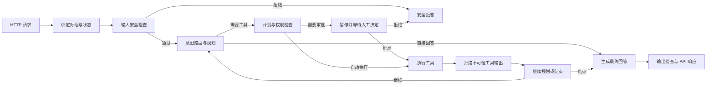

# Agent 链路改造与学习路线图

## 1. 文档用途

这份文档是 app_v2 和 app_v3 后续改造、测试、学习的跨窗口基线。

新的协作窗口开始工作时，应先阅读：

1. `D:\klin-agent\AGENTS.md`
2. 本文件 `AGENT-CHAIN.md`
3. `INTERVIEW-MARKET.md`

项目方向：

- app_v2 是主要实现，使用 LangGraph 构建可运行、可测试的真实工程链路。
- app_v3 是对比实现。现代 LangChain `create_agent` 和 middleware 的最小对比应在首个 Agent 纵切中出现，不再等到 app_v2 全部稳定后才学习；它不是第二套完整产品。
- 每次只修通一条可验收链路，随后阅读、运行、测试和复盘，不一次性重写全部代码。
- 先交付可演示的端到端纵切，再基于真实失败逐轮加深安全、持久化、性能和部署能力。
- 当前进度表示“是否完成改造和验收”，不表示目录里是否已经存在同名代码。
- 学习本项目的最终目的是服务 Agent 开发、LLM 应用开发和相邻后端岗位求职。完成标准不只是代码可运行，还要能用项目产生的代码、测试、Trace、指标和 Badcase 证据回答当前高频面试追问与场景题。
- `INTERVIEW-MARKET.md` 保存带日期的市场证据和题目来源；本文件负责把这些能力映射到学习链路、验收产物和当前状态。后续根据新的岗位描述、面经和真实面试反馈实时校准，但不能把“已写入路线”记成“已经掌握”。
- 项目推进过程中要把真实遇到的问题逐步沉淀为面试笔记，但不在项目刚开始时编写通用标准答案。笔记只收录已经有代码、测试、Trace、指标或真实操作支撑的内容。

## 2. 统一术语

| 术语 | 含义 |
|---|---|
| Workflow / Graph | 程序定义的静态流程，包括节点、边和分支 |
| Run | Workflow 的一次实际执行，可以包含多次模型和工具调用 |
| Turn | 一次用户输入和一次最终回答 |
| Trace | 一次 Run 的完整执行记录，包括每个节点和工具调用 |
| Thread / Conversation | 多个 Turn 共享的对话和检查点状态 |
| Node / Stage | 主链路中的一个处理步骤 |

用户提交一次提示词，Agent 经历判断、规划、工具执行并返回最终答案，称为一次端到端 Run。

人工审批可能让一个 Run 暂停，并通过后续 HTTP 请求恢复。用户完成本轮后再次追问，则是同一个 Conversation 下的新 Run。

## 3. 主执行流程

配置、持久化、审计、日志、指标和错误处理是横跨主流程的工程能力，不是只执行一次的独立节点。

## 4. 校准后的交付顺序

2026-07-16 的面试市场校准显示：项目追问、RAG、评测、上下文与记忆、Agent/工具设计、后端并发与稳定性共同构成岗位主干。当前路线不能把所有配置和横切基建做完后才第一次看到 Agent 行为。

后续按可运行纵切推进：

| 迭代 | 交付结果 | 主要能力链 | 建议时间盒 |
|---|---|---|---|
| V0 最小启动 | 依赖可安装、配置可校验、应用可导入启动、health 可访问 | 01、12 的最小部分 | 0.5 至 1 天 |
| V1 Agent 纵切 | app_v2 `/chat` 跑通 Agent、一个真实只读工具、独立 thread、基础 Trace 和自动化测试；另做现代 `create_agent` 薄对比 | 02、03、05、08、10、11、12 的首轮部分 | 3 至 5 天 |
| V2 RAG 与评测 | 可解释的检索链路、离线数据集、检索/回答指标、Badcase 回归，并完成模型选型专项 | 13、14、15、17 | 5 至 7 天 |
| V3 可靠与可控 | 权限、审批恢复、提示词注入防护、幂等、预算和循环熔断 | 04、06、07、09、10、11 | 5 至 7 天 |
| V4 性能与交付 | SSE、取消与背压、限流缓存、数据库专项、负载测试、部署与运行手册 | 02、11、12、15、16 的深化部分 | 5 至 7 天 |

四阶段闸门仍然强制执行，但作用于当前已经声明边界的纵切或子链。完成首轮范围的认知、实现、运行测试和迁移验收后，可以进入下一纵切；未做的深化项必须保留在本路线图，不能被记录成已完成。

## 5. 改造链路总表

状态值：`待开始`、`进行中`、`待验收`、`已完成`、`阻塞`。

| ID | 链路 | 目标 | 首轮与深化依赖 | 状态 |
|---|---|---|---|---|
| 01 | 应用启动与配置 | 在干净环境中安装依赖、加载配置、初始化资源并启动 FastAPI | 无 | 进行中 |
| 02 | HTTP 请求入口 | 校验请求、限流、请求标识和稳定的错误响应 | 01 | 待开始 |
| 03 | 对话与状态绑定 | 创建或恢复 thread_id，隔离不同会话 | 01、02 | 待开始 |
| 04 | 输入安全预检 | 区分正常请求、分析语境和危险操作 | 02、03 | 待开始 |
| 05 | 意图路由与结构化规划 | 决定直接回答、工具调用、拒绝或澄清 | 首轮 01、03；V3 接入 04 | 待开始 |
| 06 | 计划与权限策略 | 校验工具、参数、风险和审批要求 | 05 | 待开始 |
| 07 | 人工审批与恢复 | 暂停 Run，批准或拒绝后从同一检查点恢复 | 03、06 | 待开始 |
| 08 | 工具执行 | 真实执行只读工具，处理超时、异常和重试 | 首轮 05；有副作用工具再接 06、07 | 待开始 |
| 09 | 不可信工具输出防护 | 扫描工具结果并让检测结果真正影响后续流程 | 08、06 | 待开始 |
| 10 | 循环控制与最终回答 | 继续规划、停止或生成有依据的回答 | 首轮 05、08；V3 接入 09 | 待开始 |
| 11 | 持久化、审计与可观测性 | 保存消息、检查点、工具记录、错误和 Trace | 首轮 03、05、08；逐轮覆盖 04 至 10 | 待开始 |
| 12 | 对外接口、测试与部署 | 让测试和接口伴随每个纵切，最后补齐部署与运行说明 | 各纵切 | 待开始 |
| 13 | RAG 与检索质量 | 完成切分、混合召回、重排、引用和检索调优 | 01、05 | 待开始 |
| 14 | Agent 评测与回归 | 建立数据集、离线/在线指标、Trace 归因和 Badcase 回归 | 05、11、13 | 待开始 |
| 15 | 上下文、延迟与成本 | 管理上下文和记忆，验证流式延迟、吞吐、缓存和预算 | 03、05、11、14 | 待开始 |
| 16 | 后端并发、缓存与数据库专项 | 用可运行实验验证并发模型、限流、缓存、MySQL/Redis 和线上式排障 | 02、11、12、15 | 待开始 |
| 17 | 模型选型与 LLM 应用基础 | 掌握支持模型、Prompt、RAG、长上下文和 SFT 选型所需的实用基础 | 13、14、15 | 待开始 |

## 6. 各链路验收目标

### 01 应用启动与配置

- 干净虚拟环境可以根据项目依赖完成安装。
- 依赖版本使用同一代兼容 API，不能通过无上限的 `>=` 混装旧代码和新框架。
- 从项目根目录稳定加载 `.env`，不依赖启动命令所在目录。
- 配置缺失或格式错误时给出明确错误，不把密钥写入日志或 HTTP 响应。
- ChatModel、checkpointer 和数据库资源有清晰的创建与关闭生命周期。
- `/api/health` 表示进程存活；需要时另设 readiness/runtime 状态，不通过真实 LLM 请求浪费调用额度。

### 02 HTTP 请求入口

- 请求模型、响应模型和错误模型明确。
- 空输入、超长输入和非法 conversation_id 返回稳定的 4xx。
- 配置错误、模型错误和内部错误不会全部伪装成同一种 500。
- 内部异常和密钥不会通过 `detail=str(exc)` 泄漏给客户端。

### 03 对话与状态绑定

- 未提供 conversation_id 时生成唯一 ID，不能共用 `default`。
- 相同 conversation_id 能恢复正确状态。
- 不同 conversation_id 不串消息、计划和工具结果。
- state 中的临时字段在新 Turn 开始时正确覆盖或清理。

### 04 输入安全预检

- 高风险执行请求进入拒绝路径，不调用模型或工具。
- 对危险文本进行分析、检测或解释时，不被误判为执行请求。
- 安全结果具有结构化字段和可测试的原因代码。

### 05 意图路由与结构化规划

- 无需工具的问题走直接回答路径，不被当成危险请求。
- 需要工具的问题产生经过 schema 校验的计划。
- 使用框架结构化输出能力，不用正则从 Markdown 中截取 JSON。
- 模型格式异常有可控重试或明确错误路径。

### 06 计划与权限策略

- 未知工具、非法参数和越权操作在执行前被拦截。
- 安全检查能够看到模型原始计划，不能先过滤再假装检查。
- 每种工具具有 auto、confirm 或 deny 策略。

### 07 人工审批与恢复

- 使用 LangGraph `interrupt()` 和 `Command(resume=...)`。
- 审批请求包含工具名、参数、风险、原因和 Run 标识。
- 批准、编辑、拒绝均有确定行为。
- 恢复时使用同一 thread_id，副作用保持幂等。
- 有副作用的工具定义幂等键、重复请求行为以及失败后的补偿或人工恢复路径。

### 08 工具执行

- 工具返回真实数据；环境不支持时返回 unavailable，不能返回伪造的正常数据。
- 路径、命令和参数有真实安全边界。
- 超时、异常、部分成功和重试状态可以区分。
- 工具结果包含可审计的来源和耗时。

### 09 不可信工具输出防护

- 日志、网页和文件内容默认视为不可信数据。
- 注入扫描结果进入 state，并实际影响总结、继续执行或拒绝路径。
- 恶意工具输出不能覆盖系统规则或诱导额外工具调用。

### 10 循环控制与最终回答

- 明确继续调用工具、重新规划、直接回答和停止的条件。
- 设置模型调用和工具调用上限，避免无限循环与费用失控。
- 检测重复 state、重复工具参数和连续无进展，不能只依赖固定最大轮数。
- 超过预算或收到 kill switch/取消信号时安全停止；能够返回可信的部分结果、继续建议并留下告警与 Trace。
- 最终回答只引用本次 Run 的有效结果。
- 工具失败时不能返回 `guard_decision=allow` 并伪装成功。

### 11 持久化、审计与可观测性

- HumanMessage、AIMessage 和 ToolMessage 正确保存。
- 普通业务列表不能错误使用 `add_messages` reducer。
- 每次 Run 都记录输入摘要、节点、工具、状态、错误和最终结果。
- 审计文案与真实写入一致。
- SQLite 只用于本地学习和轻量运行；生产方案明确迁移边界。

### 12 对外接口、测试与部署

- 恢复 tools、audit、approvals、conversations、MCP 等需要保留的能力。
- 能解释 MCP、Function Calling、Tool 与 Agent 编排层的边界，并通过 `tools/list`、`tools/call`、输入输出 schema 和错误语义验证 MCP 接口。
- 每个纵切同时增加对应单元测试、集成测试和验收命令，不把测试推迟到最后。
- 测试不依赖真实付费模型，另设显式的真实模型 smoke test。
- README、启动命令、依赖文件和实际实现保持一致。

### 13 RAG 与检索质量

- 解释并实现文档切分、稀疏/稠密召回、混合排序、rerank 和引用链路。
- 通过数据而不是感觉选择 chunk、top-k、权重和 rerank 截断值。
- 能处理查询改写、信息不足时澄清、表格或结构化文档等至少一种真实难例。
- 分别测量检索质量和最终回答质量，保留失败样本。
- 使用带来源说明的查询-相关文档样本，至少计算 Recall@k，并能解释 MRR 或 nDCG 在当前任务中的适用性。
- 对查询改写、保留原查询、多路检索或父子索引至少完成一次可复现对比，说明质量、延迟和成本变化。

### 14 Agent 评测与回归

- 建立版本化的离线数据集，覆盖正常任务、工具失败、RAG 难例和安全边界。
- 数据集按场景、难度和风险分层，记录样本来源并检查训练数据或提示示例造成的评测污染。
- 区分任务成功、检索相关性、工具正确性、回答质量、延迟和成本指标。
- Trace 可以把 Badcase 归因到路由、检索、提示词、模型、工具或最终回答阶段。
- Prompt、模型、工具或检索参数变化后自动跑回归，防止“修好一类、破坏另一类”。
- 设计无标准答案时的抽样、规则、模型评审和人工复核组合，不把单一 LLM-as-judge 当真值。
- 面对 Badcase 时能说明为什么选择改 Prompt、上下文、检索、工具、模型或 SFT，而不是只会继续堆叠提示词。

### 15 上下文、延迟与成本

- 区分本轮状态、thread 级短期记忆和跨 thread 长期记忆，定义写入、检索、过期和纠错策略。
- 对上下文裁剪、摘要、选择性注入和缓存进行可复现验证。
- 记录首 token 延迟、总延迟、token/费用、工具耗时和吞吐；明确优化目标和基线。
- 流式接口支持取消、超时和背压；长任务具有步骤、时间、token 和工具调用预算。
- 验证记忆污染、冲突、用户纠正、过期与隐私删除，避免把全部历史或全部工具说明塞入 prompt。
- 工具或 Skill 数量增加时，验证候选集缩小或渐进披露策略对正确率、上下文大小和延迟的影响。

### 16 后端并发、缓存与数据库专项

- 将进程、线程、协程、GIL、锁和阻塞 I/O 与本项目的真实端点吞吐、资源释放和故障现象关联起来。
- 流式接口验证连接池、超时、客户端取消传播、背压和并发隔离；负载测试记录 QPS、并发、p50/p95/p99、错误率和取消率。
- 比较令牌桶、漏桶和滑动窗口的适用边界，并至少用 Redis 完成一种可运行的分布式限流实验。
- 为缓存说明 key、TTL、命中率、陈旧数据、击穿和一致性策略，并用测试或压测验证关键取舍。
- 通过最小可复现实验解释 MySQL 索引、事务、MVCC、锁和慢查询如何影响 Agent 服务；SQLite 不能代替这部分生产边界学习。
- 该专项可以位于项目内独立 `labs` 或测试环境，不为覆盖题目而把 MySQL、Redis 强行耦合进主 Agent 业务。

### 17 模型选型与 LLM 应用基础

- 在工程决策深度理解 token、上下文窗口、Embedding、Attention、temperature、top-p 和结构化输出失败对应用行为的影响。
- 能比较 RAG、长上下文、Prompt 调整、换模型和 SFT 的数据要求、收益、成本与风险，并用项目 Badcase 支撑选择。
- 能解释 KV Cache、batching、量化或推理服务对 TTFT、吞吐、显存和质量的影响，不要求走训练研究路线。
- 至少完成一个小型可复现实验或决策记录，而不是只背概念定义。

## 7. 端到端验收场景

| 场景 ID | 场景 | 期望结果 | 状态 |
|---|---|---|---|
| S01 | 普通咨询，不需要工具 | 直接回答，不误判为危险请求 | 待开始 |
| S02 | 查询磁盘、端口、进程或服务 | 调用真实只读工具并总结真实结果 | 待开始 |
| S03 | 删除、格式化或重启请求 | 不执行工具，返回拒绝并写审计 | 待开始 |
| S04 | 需要人工确认的操作 | 暂停、批准或拒绝，并正确恢复 | 待开始 |
| S05 | 工具超时、不可用或报错 | 返回结构化失败，不伪装成功 | 待开始 |
| S06 | 工具输出包含提示词注入 | 不服从恶意内容，记录并阻断风险 | 待开始 |
| S07 | 同一会话连续追问 | 正确使用历史上下文 | 待开始 |
| S08 | 两个会话并发请求 | 状态完全隔离 | 待开始 |
| S09 | MCP 客户端调用工具 | 复用同一工具、策略和审计链路 | 待开始 |
| S10 | 配置缺失或模型服务异常 | 返回明确的配置或上游服务错误 | 待开始 |
| S11 | RAG 查询命中稀疏与稠密证据 | 返回可引用结果，并能解释召回、重排和截断 | 待开始 |
| S12 | Prompt 或检索参数变更 | 自动运行版本化数据集并显示质量、延迟和成本回归 | 待开始 |
| S13 | 长任务、高并发或客户端取消 | 不无限循环，正确停止、释放资源并留下 Trace | 待开始 |
| S14 | Agent 误选工具、参数错误或重复调用 | 从 Trace 分类错误，定位工具边界或路由问题，并用版本化用例证明修复没有引入回归 | 待开始 |
| S15 | 一千条或更多数据需要聚合计算 | 让确定性代码、SQL 或工具负责计算；完成输入校验、分批、并发、重试、幂等和最终校验 | 待开始 |
| S16 | 长期记忆出现污染、冲突、过期或删除请求 | 正确选择、纠正、过期或删除记忆，并证明其他会话和审计记录不受破坏 | 待开始 |
| S17 | 线上高峰时流式接口卡顿 | 用分段耗时与 p50/p95/p99 定位瓶颈，验证限流、缓存、背压、取消传播或并发隔离的改进 | 待开始 |

## 8. 模块之间如何耦合

链路不是完全独立的，但应通过明确契约连接：

1. 数据耦合：节点通过 AgentState 交换结构化数据。
2. 控制耦合：LangGraph 的边根据 state 决定下一节点。
3. 资源耦合：模型、工具、数据库和配置通过应用生命周期注入。
4. 横切能力：安全、审计、日志和指标覆盖多个节点。

目标不是消灭所有耦合，而是做到：

- 节点职责单一。
- 输入和输出类型明确。
- 路由规则集中且可测试。
- 一个节点可以使用假模型或假工具独立测试。
- 修改工具实现时不需要重写 API 和状态模型。

## 9. 学习与改造协议

问题拆解和细化是强制协作原则。复杂项目先拆成链路，链路再拆成阶段；每个阶段必须写清目标、范围、任务、依赖和完成证据。始终让用户知道当前学到哪里、完成了什么、剩下什么，以及为什么进入下一步。

每条链路固定分成四个阶段，并严格按顺序进行：

| 阶段 | 目标 | 用户需要掌握或完成 | 通过证据 |
|---|---|---|---|
| 1. 链路认知 | 看懂边界和当前实现 | 输入输出、涉及文件、调用顺序、依赖和现有问题 | 回答针对性问题，能独立复述调用方向 |
| 2. 改造与读码 | 完成本链路实现并理解最终代码 | 关键代码块、框架用法、修改原因和工程取舍 | 能沿最终代码解释行为和关键分支 |
| 3. 运行与测试 | 在真实开发环境验证 | 安装、启动、调用、测试、观察日志和定位错误 | 用户亲自执行并提供真实结果，验收条件通过 |
| 4. 复盘与迁移 | 确认真正掌握并能够应用 | 独立讲解、诊断和小范围修改 | 完成复盘问答及一个小练习或改动 |

阶段闸门规则：

1. 每个阶段开始前，AI 必须明确本阶段学什么、暂时不学什么、完成标准是什么。
2. 进入下一阶段前，AI 必须通过具体问题或实际操作检查用户是否完成，不能只问“懂了吗”。
3. 用户没有完成、回答不完整或明确表示没看完时，继续停留在当前阶段，补足缺口后再次检查。
4. 阶段 1 不修改业务代码；只有用户通过阶段 1，才能进入阶段 2。
5. 当前链路被其他链路阻塞时，只做最小必要处理，并记录问题归属，不暗中开展下一条链路。
6. 每个阶段结束时更新路线图，记录状态、文件、命令、验证证据、遗留问题和下一道闸门。
7. 不以记住每行语法为标准。重点是理解职责、调用、输入输出、错误、设计原因以及如何运行和修改。

### 9.1 验收质量标准

验收是教学中的核心责任，不是流程打勾。每条链路、每个阶段能否继续，取决于高质量证据，而不是 AI 已经讲完或用户主观感觉听懂。

验收必须从当前阶段的学习目标和完成标准反向设计，并遵守以下规则：

1. 检查理解，不检查死记。重点考察职责、边界、调用顺序、因果关系和设计原因。
2. 问题数量保持少而有效，避免偏题、文字陷阱、无关语法和题干直接泄露答案。
3. 先让用户独立作答或操作，再根据需要逐级给提示，不能提前把标准答案讲完后再问是否理解。
4. 回答不完整时，指出具体缺口，只补学该缺口，再使用不同问题或任务复验。
5. 所有关键学习目标都要有证据。不能因为“大部分答得差不多”就模糊放行。
6. 验收记录包括：使用的方法、用户提供的证据、仍然薄弱的地方、是否通过以及下一道闸门；不得记录密钥等敏感内容。
7. 每条链路结束时必须安排至少一个用户没见过的迁移任务，确认用户能够应用，而不是只会复述示例。

各阶段优先采用的验收方式：

| 阶段 | 主要验收方式 |
|---|---|
| 1. 链路认知 | 独立复述边界、重建调用顺序、判断文件职责、预测某个配置或依赖变化的结果 |
| 2. 改造与读码 | 沿最终代码讲解、说明设计取舍、定位应该修改的位置、解释关键分支 |
| 3. 运行与测试 | 亲自执行命令和 API、解释输出、阅读失败测试或日志并完成定位 |
| 4. 复盘与迁移 | 脱离逐步提示完整讲解，并完成一个新的诊断、扩展或小修改 |

不建议一开始逐行阅读所有文件。注释、导入、样板代码和框架内部细节可以后看；配置、状态、资源生命周期和关键分支可以在对应阶段逐行精读。

### 9.2 市场与版本校准闸门

在 V1、V2、V3、V4 每个里程碑结束时增加一次轻量校准：

1. 检查最近面试证据是否改变了能力优先级，不用单篇热帖决定路线。
2. 对易变 API 查当前官方文档，记录旧实现、当前推荐实现和迁移成本。
3. 检查当前产物能否用“问题、约束、架构、指标、失败、取舍、个人贡献”完整讲解。
4. 基础工程深挖必须关联一个已出现的真实故障、性能指标或面试场景；否则进入待办，不阻塞下一纵切。
5. 频次和结论记录到带日期的校准报告，长期原则才进入 `AGENTS.md`。

### 9.3 求职完成定义与面试证据闸门

本项目以求职能力为最终结果，但区分三个层次：

1. **路线覆盖**：高频题已经映射到链路、验收场景和所需产物。
2. **工程完成**：对应代码或专项实验可运行，自动化测试和真实验收通过，并保存 Trace、指标或 Badcase 证据。
3. **面试掌握**：用户能够脱离逐步提示解释设计、预测行为、定位故障、比较方案并完成一个没见过的迁移题。

只有第三层通过，才可以把对应面试领域记为 `已掌握`。代码存在、AI 讲过或文档写过都不能替代这一证据。

每个 V1 至 V4 里程碑结束时，除四阶段链路验收外，再执行一次面试证据闸门：

- 从对应高频题中抽取少量高信号问题，不提前给标准答案。
- 至少包含一个项目追问、一个真实故障或场景题和一个方案取舍题。
- 回答必须引用本项目的真实文件、Run、测试、Trace、指标或 Badcase；纯概念答案不能单独通过。
- 记录回答证据、薄弱点、复验结果和状态。问题可以随市场更新，但通过标准不能临时降低。
- 新岗位描述、面经或真实面试反馈先更新 `INTERVIEW-MARKET.md` 的带日期证据，再同步本节映射和优先级。

高频领域映射：

| 领域 ID | 高频追问范围 | 主要链路/场景 | 最低面试证据 | 状态 |
|---|---|---|---|---|
| I01 | 为什么用 Agent；LangGraph、`create_agent`、Workflow 或自研如何选择；单/多 Agent；真实 Run；业务价值与个人贡献 | V1、03、05、08、10、11、12 | 架构图、一次真实 Trace、框架对比记录、失败案例和个人贡献说明 | 待开始 |
| I02 | BM25+dense、chunk、父子索引、top-k、rerank、查询改写、RAG 评测与成本 | 13、14、15、S11、S12 | 数据集来源、检索/回答指标、参数对比和 Badcase 前后结果 | 待开始 |
| I03 | state、短期/长期记忆、摘要/检索、污染、冲突、过期、纠错、删除与渐进披露 | 03、11、15、S07、S16 | 多轮测试、隔离证据、记忆策略实验和失败样本 | 待开始 |
| I04 | Tool Schema、选错工具、MCP 边界、超时/部分成功、幂等、审批、审计、补偿和恶意输出 | 05 至 12、14、S02 至 S06、S09、S14 | 工具契约、错误 Trace、审批恢复、注入测试和回归结果 | 待开始 |
| I05 | 任务成功、数据集分层与污染、Prompt 回归、Badcase 归因、模型/检索/Prompt/SFT 决策与在线抽检 | 11、13、14、15、17、S12 | 版本化评测集、指标报告、归因记录和人工复核样本 | 待开始 |
| I06 | SSE、取消、背压、QPS 瓶颈、限流、缓存、MySQL/Redis、TTFT、吞吐与故障恢复 | 02、11、12、15、16、S13、S17 | 压测报告、分位数指标、瓶颈定位和优化前后对比 | 待开始 |
| I07 | Attention、采样、上下文、Embedding、推理性能、RAG/长上下文/SFT 选型 | 13 至 17 | 小实验或决策记录，并能联系项目问题解释取舍 | 待开始 |

算法与现场编码继续使用独立的 LeetCode/编码路线，不由本项目替代，但应在求职总复盘中单独检查进度。

大厂常见场景题映射：

| 市场场景 | 本路线场景 | 核心链路 | 状态 |
|---|---|---|---|
| Agent 经常选错工具 | S14 | 05、06、08、11、14 | 待开始 |
| 长任务循环或费用失控 | S13 | 07、10、11、15 | 待开始 |
| Prompt 调优出现回归 | S12 | 14、15、17 | 待开始 |
| RAG 相关性和回答都不好 | S11、S12 | 13、14、15 | 待开始 |
| 一千条数据需要求和 | S15 | 05、08、10、12、16 | 待开始 |
| 工具输出包含 Prompt Injection | S06 | 06、09、11、14 | 待开始 |
| 线上高峰流式接口卡顿 | S17 | 02、11、12、15、16 | 待开始 |

### 9.4 面试笔记与跨窗口防丢

计划产物：`INTERVIEW-NOTES.md`。

当前状态：`尚未创建`。项目刚开始，暂时没有足够的真实问题、修改和验证证据，不创建空壳笔记或提前编写套话。

开始时机：

1. 第一条链路完成四阶段验收，并产生至少一个值得面试复盘的真实问题；或
2. 某个里程碑已经形成可展示的 Run、Trace、指标、Badcase 或故障定位记录；或
3. 用户明确要求开始整理。

每条笔记至少包含：

1. **面试问题**：对应 `INTERVIEW-MARKET.md` 的高频追问或场景题。
2. **项目背景**：问题在本项目的哪条链路、什么条件下出现。
3. **现象与约束**：真实错误、失败行为、性能数据或业务边界。
4. **原因分析**：如何通过代码、日志、Trace、测试或实验定位。
5. **方案与取舍**：比较过哪些方案，为什么采用当前框架或实现。
6. **实施与验证**：修改了什么，运行了哪些命令和测试，结果如何。
7. **结果与局限**：只记录真实测量结果，明确本地实验和生产数据的区别。
8. **个人贡献**：用户能够独立讲清、诊断或修改的部分。
9. **可能追问**：面试官可能继续追问的边界、失败模式和替代方案。

保存与提醒规则：

- 每条链路或里程碑结束时，AI 检查是否出现新的面试笔记候选，并提醒用户决定是否沉淀。
- 用户准备切换窗口、当前任务明显过长或上下文可能压缩时，AI 应先更新本路线图的进度记录，保存当前链路、阶段、文件、命令、决策、证据、遗留问题、笔记候选和下一道闸门。
- `INTERVIEW-NOTES.md` 创建后，切换窗口前同步已经完成且有证据的笔记；未验证内容只能标为候选，不能写成已经掌握。
- 项目完成时，AI 必须提醒用户完成整份面试笔记，并用笔记进行项目讲解、连续追问、场景题和迁移题的最终验收。
- 不得编造线上规模、业务收益、性能数字、事故经历或个人贡献。没有真实生产数据时，明确写成“本地实验”“测试环境结果”或“设计方案”。

## 10. 当前链路：01 应用启动与配置

当前阶段：`阶段 1 - 链路认知`

阶段状态：`进行中`

当前闸门：用户完成限定阅读后，回答链路边界、配置来源和当前启动顺序相关问题。通过前不修改 app_v2 业务代码。

校准后的首轮边界：V0 只要求锁定兼容依赖、稳定加载配置、完成导入/启动/health 和一组启动测试。复杂资源生命周期、readiness、真实模型 smoke test 和生产级部署边界保留为链路 01 的深化迭代，不阻塞 V1 Agent 纵切。

### 10.1 本链路边界

起点：一台只有 Python 和项目源码的开发机。

终点：依赖可重复安装，配置可验证，FastAPI 可以启动，模型和 checkpointer 可以按需初始化，健康状态真实可读。

本链路暂时不处理用户 prompt、AgentState 路由、工具调用和回答生成。

### 10.2 需要阅读的文件

按以下顺序阅读，不是一行一行通读：

1. `requirements-v2.txt`
   只看依赖职责、版本边界以及它们是否属于同一代 API。
2. `.env.example`
   只看配置契约，不读取或展示真实 `.env` 中的密钥值。
3. `app/config.py`
   仅作为对照与诊断材料：用它理解项目根目录和 `.env` 稳定定位的工程问题，不把旧版实现作为主学习路径。
4. `app_v2/model/chat_model.py`
   看模型由哪些配置构造、什么时候创建、错误在哪里暴露。
5. `app_v2/memory/checkpointer.py`
   看数据库路径、连接创建和资源生命周期。
6. `app_v2/graph/builder.py`
   只追踪 checkpointer 如何进入 `graph.compile()`，暂不深挖节点逻辑。
7. `app_v2/main.py`
   看模块导入时发生什么、FastAPI 何时初始化、health 是否反映真实状态。
8. 本链路新增的配置和启动测试。
   用测试反向确认前面理解的契约。

### 10.3 第一遍不需要深挖的内容

- LangGraph 每个节点的业务逻辑。
- SafetyGuard 的正则规则。
- 每个系统工具的命令实现。
- SQLite checkpointer 内部表结构。
- LangChain ChatOpenAI 的内部 HTTP 实现。

这些内容分别属于后续链路。

### 10.4 首轮计划中的实现步骤

1. 确定并锁定兼容的现代 LangChain/LangGraph 版本范围。
2. 建立 app_v2 的单一 Settings 配置入口。
3. 校验 URL、model、timeout 等字段，并保护 API key。
4. 让 ChatModel 只依赖 Settings，不在模块各处直接读取环境变量。
5. 让应用可以导入、启动和关闭，`/api/health` 表达清楚的 liveness。
6. 补依赖导入、启动、配置缺失和配置非法测试。

首轮通过后进入 V1。以下内容留到链路 01 的深化迭代：checkpointer 完整连接生命周期、复杂 lifespan 资源管理、readiness/runtime 状态、真实模型 smoke test 和生产部署边界。

### 10.5 V0 首轮通过标准

- [ ] 依赖版本锁定且 `app_v2` 关键模块可以导入。
- [ ] `.env` 从固定项目路径加载，错误不泄漏密钥。
- [ ] FastAPI 可以启动、访问 health 并正常关闭。
- [ ] 首轮自动化测试全部通过。
- [ ] 用户能解释配置来源、启动顺序、失败位置和为何把深化项后移。

### 10.6 链路 01 最终完成标准

- [ ] 依赖安装成功且导入路径与当前官方 API 一致。
- [ ] `.env` 从固定项目路径加载。
- [ ] 缺少必要配置时错误清楚且不泄漏密钥。
- [ ] FastAPI 可以启动和正常关闭。
- [ ] health 和 runtime 状态含义明确。
- [ ] SQLite 数据路径固定在项目 data 目录。
- [ ] 本链路自动化测试全部通过。
- [ ] 完成一次显式的真实环境启动验证。

### 10.7 阶段 1 当前认知缺口与后续补充项

这些记录用于防止“项目当前没写，所以学习中没看到”的能力被遗漏。它们不是阶段 1 已掌握证据，后续必须通过代码、测试、Trace 或用户独立解释补齐。

- `app_v2/model/chat_model.py` 当前只展示了从环境变量构造 `ChatOpenAI` 的雏形；还缺少 app_v2 单一 Settings 入口、字段校验、配置错误分类和密钥脱敏。归属：链路 01 Stage 2 / V0 首轮。
- `app_v2/memory/checkpointer.py` 当前只创建 `SqliteSaver` 资源；checkpointer 的工程价值要在 `builder.py` 的 `compile(checkpointer=...)` 与 `runner.py` 的 `thread_id` 配合中体现。后续必须用测试证明同一 thread 可延续、不同 thread 隔离。归属：链路 03 / V1 首轮，链路 11 补 Trace 证据。
- 当前 `runner.py` 对未传 `conversation_id` 的请求使用 `thread_id="default"`，会导致匿名请求共享状态；该问题已在 B06 记录，后续需要生成唯一会话 ID 并用并发/隔离测试证明。归属：链路 03 / V1 首轮。
- 人工中断、审批恢复和 `Command(resume=...)` 不是 `checkpointer.py` 单文件能体现的能力；当前只记录为后续学习缺口，等待链路 07 通过真实暂停/恢复 Run 验证。
- checkpointer 连接关闭、FastAPI lifespan 资源管理、readiness/runtime 状态属于链路 01 深化项；V0 不以生产级完整生命周期为阻塞，但不能记录为已完成。
- 如果后续阅读发现某个面试高频能力因为当前项目缺代码、缺测试或缺 Trace 而无法形成证据，必须在本节或对应链路下新增补充项，再决定是补进主 Agent 产品还是做 companion lab。

## 11. 已知基线问题

这些问题来自 2026-07-15 的静态审查，后续修复时逐项关闭：

- [ ] B01 app_v2 条件路由返回值与 builder 的 path_map 不匹配。
- [ ] B02 app_v3 prompt 没有使用本轮 `input`。
- [ ] B03 app_v3 使用旧 AgentExecutor API，但依赖允许安装现代 LangChain 1.x。
- [ ] B04 app_v2 的普通 `tool_calls` 字典列表错误使用 `add_messages`。
- [ ] B05 `app_v2/audit/__init__.py` 含 `<longcat_arg_value>`，无法解析。
- [ ] B06 app_v2 匿名请求共用 `thread_id=default`。
- [ ] B07 空计划被错误路由为高风险拒答。
- [ ] B08 审批和审计模块未进入主执行链路。
- [ ] B09 工具输出扫描结果没有真正影响后续行为。
- [ ] B10 system_logs 在真实命令不可用时返回模拟数据并标记成功。
- [ ] B11 工具路径根目录使用 `parents[3]`，超出项目根目录。
- [ ] B12 app_v2 和 app_v3 没有稳定加载现有 `.env`。
- [ ] B13 新版本缺少旧版已有的工具、审计、审批、会话、MCP 和前端接口。
- [ ] B14 项目缺少针对 app_v2/app_v3 的自动化测试。

## 12. 进度记录

### 2026-07-15

- 完成 app_v2 和 app_v3 静态代码审查。
- 确定 app_v2 为主要改造和学习版本。
- 确定 app_v3 后续用于现代 LangChain 与自定义 LangGraph 的对比学习。
- 创建本路线图。
- 将四阶段学习协议和强制阶段闸门同步到 `D:\klin-agent\AGENTS.md` 与本路线图。
- 增加验收质量标准，要求验收覆盖理解、推理、实操、排错和迁移，并记录真实证据。
- 当前进入链路 01 的阶段 1：链路认知。
- 尚未修改 app_v2 或 app_v3 的业务代码。

### 2026-07-16

- 明确旧版 `app` 目录降级为对照与诊断材料，不作为主学习路径。
- 当前主线保持为 app_v2：优先学习如何借助 LangGraph、LangChain 和 FastAPI 交付可靠 Agent 应用。
- 旧版只在框架行为令人困惑、需要解释设计取舍或定位故障时，回看对应的一小段实现。
- 链路 01 阶段 1 继续进行；用户已阅读 `app/config.py`，下一步转入 app_v2 的模型、检查点、图编译和 API 入口认知。
- 完成牛客、小红书、抖音 18 篇 Agent/LLM 应用/后端面经的市场校准，详见 `INTERVIEW-MARKET.md`。
- 结论为“基础方向合理，但执行顺序失衡且缺少 RAG、评测回归、上下文/性能链路”；未把底层工程能力判定为无用。
- 将路线改为 V0 至 V4 的多轮端到端纵切；保留四阶段闸门，并把链路 01 首轮范围缩到可启动、可测试的最小基线。
- 提前现代 LangChain `create_agent` 对比，新增链路 13 至 15，并要求测试、Trace 和指标伴随每个纵切。

### 2026-07-17

- 明确本项目最终服务于 Agent、LLM 应用和相邻后端岗位求职，代码可运行不是唯一完成标准。
- 增加求职完成定义和面试证据闸门，把路线覆盖、工程完成和面试掌握分开记录。
- 将高频面试领域 I01 至 I07 映射到链路、验收场景和最低证据。
- 将七类大厂常见场景题映射到 S06、S11 至 S15、S17，并新增工具误选、确定性聚合、记忆污染和高峰流式卡顿场景。
- 新增链路 16 后端并发/缓存/数据库专项和链路 17 模型选型/LLM 应用基础；允许使用可运行 companion lab，避免把所有题目强行耦合进主 Agent 产品。
- 将跨窗口求职目标和文档读取顺序同步到 `D:\klin-agent\AGENTS.md`。
- 约定未来生成 `INTERVIEW-NOTES.md`，只沉淀本项目真实经历和证据支持的面试回答；当前不创建空笔记。
- 增加链路/里程碑提醒和跨窗口防丢规则，要求切换前保存进度、证据、遗留问题、笔记候选和下一道闸门。
- 当前仍停留在链路 01 阶段 1；本次只更新学习与验收文档，没有修改 app_v2 或 app_v3 业务代码。
- 在链路 01 下新增阶段 1 认知缺口记录：区分“当前代码雏形”“后续必须补代码/测试/Trace 证据”和“深化迭代项”，避免因为项目暂未实现而漏学 checkpointer、多轮隔离、恢复和配置校验等能力。
