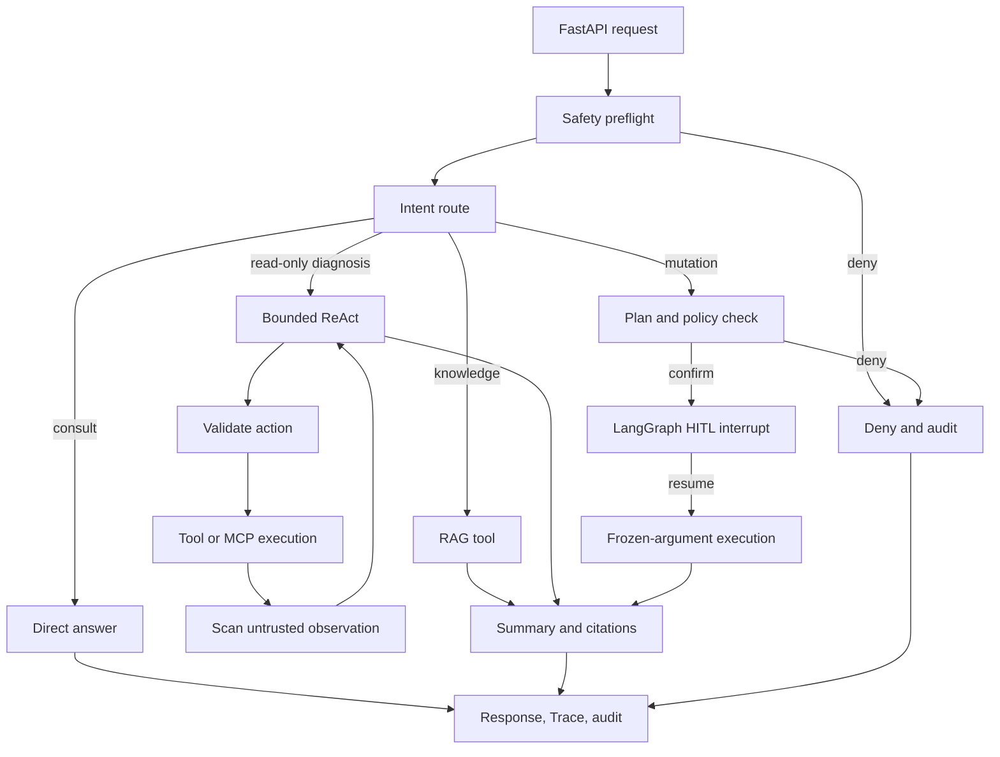

# Kylin Secure OS Agent

面向 Agent、LLM 应用和后端岗位的求职项目。当前唯一实现目录是
`app_v4`。

项目范围不追求“大而全”，但实际启用的能力必须可运行、可测试、可追踪，
并采用主流组件。手写教学实现不能作为生产主路径或完成证据。

## 当前状态

已经基本完成：

- FastAPI 同步对话和 SSE 接口
- LangGraph 外层受控 Workflow
- 只读诊断 bounded ReAct
- 真实只读系统工具
- 独立 `thread_id`、SQLite checkpoint 和长期记忆基础
- 高危拒绝、注入防护、auto/confirm/deny 工具权限
- LangGraph `interrupt()` / `Command(resume=...)` 审批恢复
- Trace、审计、预算、限流和缓存基础
- 官方 MCP Server/Client 及协议集成测试

仍未完成：

- 基于真实 Embedding 与 Milvus 的 RAG 主路径
- `/api/chat` 默认 MCP 生产路径收口
- 真正停止底层任务的 SSE 取消与背压
- Docker Compose、真实服务 smoke test 和最终面试证据

详细状态见 [WORK-STATE.md](app_v4/docs/WORK-STATE.md)。

## 架构



职责边界：

- FastAPI：HTTP 契约、输入校验、流式响应和依赖容器。
- LangGraph：状态、路由、循环、checkpoint、HITL 和停止条件。
- LangChain：模型、Message、Tool、Embedding、Splitter、Retriever、
  VectorStore 等集成。
- Safety/Policy：校验模型提出的候选动作；模型输出不能直接执行工具。
- MCP：跨进程工具协议；与 Agent 复用同一策略和审计服务。

## 环境

- Python 3.13
- 项目根目录：`D:\klin-agent\kylin-os-agent`
- 真实配置文件：项目根目录 `.env`

禁止打印、改写或提交 `.env` 的真实密钥。配置示例使用 `.env.example`。

安装当前依赖：

```powershell
pip install -r requirements-v2.txt
```

## 启动

真实模型：

```powershell
python -m uvicorn app_v4.main:app --host 127.0.0.1 --port 8000
```

确定性测试模型：

```powershell
$env:APP_V4_USE_FAKE_MODEL="true"
python -m uvicorn app_v4.main:app --host 127.0.0.1 --port 8000
```

浏览器访问：

```text
http://127.0.0.1:8000
```

## API

| Method | Path | Purpose |
|---|---|---|
| `POST` | `/api/chat` | 同步 Agent Run |
| `POST` | `/api/chat/stream` | SSE Agent Run |
| `GET` | `/api/health` | 存活状态 |
| `GET` | `/api/traces/{run_id}` | 查询 Trace |
| `GET` | `/api/audit` | 查询审计记录 |
| `GET` | `/api/approvals` | 查询审批 |
| `POST` | `/api/approvals/{id}/approve` | 批准 |
| `POST` | `/api/approvals/{id}/reject` | 拒绝 |
| `POST` | `/api/approvals/{id}/resume` | 从 checkpoint 恢复 |
| `POST` | `/api/mcp` | 兼容旧客户端的 JSON-RPC 入口 |

## 测试

```powershell
python -m pytest app_v4/tests -q -p no:cacheprovider
```

最近一次独立验证基线：

```text
191 passed, 4 deselected
```

该数字是迁移前回归基线，不代表 RAG、真实 MCP 默认路径或 SSE 取消已经完成。

测试分层包括：

- 纯策略与组件单元测试
- FastAPI 黑盒测试
- thread/依赖容器并发隔离
- HITL 中断恢复
- 官方 MCP streamable HTTP 集成
- 显式真实工具与真实 Embedding smoke test

## MCP

stdio Server：

```powershell
python -m app_v4.mcp.native_server
```

Web Agent 的生产 MCP 路径通过 `MCP_SERVER_URL` 显式配置。未配置时使用的
本地 invoker 只属于开发/测试边界，不能作为最终生产默认路径的验收证据。

## RAG

旧的手写 BM25、TF-IDF、SVD/LSA、字符串改写和覆盖率重排不再是目标方案。

批准的最小主流路径：

```text
LangChain Document
  -> RecursiveCharacterTextSplitter
  -> real Embedding
  -> Milvus Standalone
  -> dense + built-in BM25
  -> RRF
  -> citations
```

Milvus 使用 Docker Compose 提供持久化向量索引。先跑通上传/导入、索引、
检索、引用和小型评测；只有真实 Badcase 证明有必要时，再增加
cross-encoder rerank、query rewrite 或父子索引。

在该迁移完成前，RAG 状态是 `NOT ACCEPTED`。

## 关键设计

### 为什么使用自定义 StateGraph

`create_agent` 适合快速交付标准工具循环。本项目需要显式安全预检、权限检查、
HITL、只读 bounded ReAct、副作用固定执行链以及逐节点 Trace，因此保留
自定义 LangGraph StateGraph。LangChain 生态组件仍在图内使用，两者不是替代关系。

### 为什么不是全 ReAct

只读诊断允许模型根据观察结果决定下一步，但有迭代、工具、错误和无进展预算。
副作用操作不允许自由循环，必须经过固定计划、策略、审批和验证路径。

### 为什么模型不能直接调用工具

模型负责处理不确定性并提出结构化候选决策；编排层负责确定性的授权和执行。
所有工具调用必须经过 schema、白名单、参数、权限、风险、预算和审批校验。

## 文档

- `D:\klin-agent\app4-需求清单.md`：不可降低的目标与验收基线
- `AGENT-CHAIN.md`：项目路线图
- `app_v4/docs/WORK-STATE.md`：当前状态唯一真相源
- `app_v4/docs/HANDOFF-LATEST.md`：下一窗口恢复入口
- `app_v4/docs/FINAL-ACCEPTANCE-MATRIX.md`：当前验收矩阵
- `app_v4/MANUAL-TEST.md`：手工演示检查单

不要新增重复的 status、audit、sprint、acceptance 或 handoff 文档。

