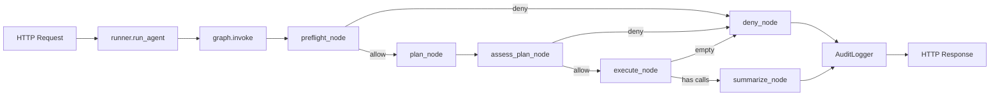

# Kylin Secure OS Agent v4

可运行、可测试、可面试讲解的 LangGraph Agent 成品。

## 项目目标

基于 LangGraph + FastAPI 构建安全运维 Agent：
- 自然语言输入 → LLM 规划 → 工具调用 → 安全扫描 → 总结回答
- 多轮对话隔离、高危拒绝、抗注入、完整 Trace

## 安装

```bash
# 推荐：使用锁定版本安装（Python 3.13.x）
pip install -r requirements-v2.txt
```

> 依赖版本已锁定（2026-07-20），`requirements-v2.txt` 中每个包都有精确版本号，确保可复现。

## 启动

```bash
# 使用真实 LLM（需配置 .env）
python -m uvicorn app_v4.main:app --host 127.0.0.1 --port 8000

# 使用假模型测试（不调用外部 API）
set APP_V4_USE_FAKE_MODEL=true  # Windows
export APP_V4_USE_FAKE_MODEL=true  # Mac/Linux
python -m uvicorn app_v4.main:app --host 127.0.0.1 --port 8000
```

## 测试

```bash
python -m pytest app_v4/tests/ -v
```

## API 示例

### 健康检查
```bash
curl http://127.0.0.1:8000/api/health
```

### 分析磁盘
```bash
curl -X POST http://127.0.0.1:8000/api/chat \
  -H "Content-Type: application/json" \
  -d '{"message":"帮我分析磁盘"}'
```

### 多轮追问（用第一次返回的 thread_id）
```bash
curl -X POST http://127.0.0.1:8000/api/chat \
  -H "Content-Type: application/json" \
  -d '{"message":"那进程呢","thread_id":"<上次的 thread_id>"}'
```

### 查询 Trace
```bash
curl http://127.0.0.1:8000/api/traces/<run_id>
```

### 查询审计日志
```bash
curl http://127.0.0.1:8000/api/audit
```

## 架构图



## 一次 Run 的节点流程

```
START
  → preflight: SafetyGuard.check_input()
      → 高危? ──yes──→ deny_node: 生成拒绝回答
      → 否
  → plan: LLM 生成 {intent, plan}
  → assess_plan: SafetyGuard.check_plan()
      → 越权? ──yes──→ deny_node
      → 否
  → execute: 循环调用 @tool.invoke()，记录 duration_ms + output_scan
  → summarize: LLM 生成中文结论
  → END
```

## Trace 示例

```json
{
  "run_id": "550e8400-e29b-41d4-a716-446655440000",
  "thread_id": "xxx-xxxx-xxxx",
  "intent": "disk_analysis",
  "guard_decision": "allow",
  "tool_calls": [
    {
      "tool_name": "disk_usage",
      "status": "success",
      "duration_ms": 1.23,
      "source": "python.shutil",
      "data": { "used_percent": 72.5, "total_bytes": 512000000000 }
    }
  ],
  "trace_summary": {
    "total_steps": 5,
    "total_duration_ms": 15.6,
    "steps": ["preflight", "plan", "assess_plan", "execute", "summarize"]
  }
}
```

## 为什么自定义 StateGraph 而非 `create_agent`

`create_agent` 是现代 LangChain 的标准 Agent API，**底层同样构建在 LangGraph 之上**，支持 middleware、checkpointer、thread_id、HITL（`interrupt`）等能力。本项目选择**自定义 StateGraph** 而非 `create_agent`，原因不是 `create_agent` 做不到，而是以下显式需求：

| 需求 | 自定义 StateGraph 的优势 | 用 `create_agent` 的代价 |
|---|---|---|
| **显式节点拓扑** | 安全预检→规划→权限检查→执行→总结，每步独立可测试 | `create_agent` 封装了循环，节点边界模糊 |
| **定制策略引擎** | `assess_plan_node` 可审计模型原始计划后再过滤 | 需通过 middleware 注入，调试困难 |
| **精确 HITL** | `execute_node` 内按工具权限触发审批，同一图内恢复 | `create_agent` 的 HITL 需遵循其生命周期 |
| **教学可解释性** | 每个节点对应一个 Python 函数，面试时可逐行讲解 | `create_agent` 黑盒度高，难以展示内部决策 |
| **Trace 归因** | 每个节点记录 duration_ms + 策略决定 + 原因码 | 需额外 instrumentation |

**代价**：自定义 StateGraph 需要手动管理状态 reducer、条件边、checkpoint 合并，代码量大于 `create_agent`。这是为**可审计性、可教学性、精确安全控制**付出的合理代价。

**结论**：如果目标是快速交付标准 ReAct Agent，`create_agent` 是更好的选择；本项目目标是**可面试讲解的安全 Agent 成品**，需要让面试官能沿任意一个节点追问决策逻辑，因此选择自定义 StateGraph。
